# Context

## Table of Contents

- [docs/HARDWARE-REFERENCE.md](#docshardware-referencemd)
  - [Hardware Reference - M5 Capsule](#hardware-reference-m5-capsule)
- [docs/LOGO.md](#docslogomd)
  - [Logo](#logo)
- [docs/TICKET.md](#docsticketmd)
  - [Ambio: Always-on Conversation Recorder Pendant](#ambio-always-on-conversation-recorder-pendant)
- [docs/ULTRASONICS.md](#docsultrasonicsmd)
  - [Ultrasonics](#ultrasonics)
  - [My recommendation, given your use-case](#my-recommendation-given-your-use-case)
  - [0) Assumptions](#0-assumptions)
  - [1) 4-FSK tones](#1-4-fsk-tones)
  - [2) Symbol timing + burst length](#2-symbol-timing-burst-length)
  - [3) Frame format (binary, compact, not ASCII)](#3-frame-format-binary-compact-not-ascii)
  - [4) Preamble + sync (acquisition that actually works)](#4-preamble-sync-acquisition-that-actually-works)
  - [5) CRC](#5-crc)
  - [6) Inhibition semantics (TTL + refresh)](#6-inhibition-semantics-ttl-refresh)
  - [7) CSMA/CA (listen-before-talk + random backoff)](#7-csmaca-listen-before-talk-random-backoff)
  - [8) “Fast start” on state changes](#8-fast-start-on-state-changes)
  - [9) Helper MCU ↔ ESP32 interface (TX-only UART + optional IRQ)](#9-helper-mcu-esp32-interface-tx-only-uart-optional-irq)
  - [10) Implementation notes that will save you pain](#10-implementation-notes-that-will-save-you-pain)
  - [11) Summary of the “do this” plan](#11-summary-of-the-do-this-plan)
  - [1) Air frame: exact bits and packing](#1-air-frame-exact-bits-and-packing)
  - [2) Goertzel parameters and sampling](#2-goertzel-parameters-and-sampling)
  - [3) Receiver state machine (helper MCU)](#3-receiver-state-machine-helper-mcu)
  - [4) Transmitter scheduling + CSMA/CA (in each guard device)](#4-transmitter-scheduling-csmaca-in-each-guard-device)
  - [5) Pseudocode (helper MCU)](#5-pseudocode-helper-mcu)
  - [6) CSMA scheduler pseudocode](#6-csma-scheduler-pseudocode)
  - [7) ESP32 side: dead simple](#7-esp32-side-dead-simple)
  - [8) One important design decision: “who transmits when multiple guards active?”](#8-one-important-design-decision-who-transmits-when-multiple-guards-active)
  - [1) Analog RX front-end (40 kHz) that actually behaves](#1-analog-rx-front-end-40-khz-that-actually-behaves)
  - [2) STM32G0 sampling: deterministic 200 kHz + DMA “symbol windows”](#2-stm32g0-sampling-deterministic-200-khz-dma-symbol-windows)
  - [3) Goertzel compute budget (sanity)](#3-goertzel-compute-budget-sanity)
  - [4) Concrete STM32G0 pipeline structure](#4-concrete-stm32g0-pipeline-structure)
  - [5) TX side (guard devices) note](#5-tx-side-guard-devices-note)
  - [6) What I’d build first (v0 hardware)](#6-what-id-build-first-v0-hardware)
  - [7) If you want _even more_ detail](#7-if-you-want-even-more-detail)
- [README.md](#readmemd)
  - [Ambio](#ambio)
- [.github/copilot-instructions.md](#githubcopilot-instructionsmd)
  - [Ambio (Pendant)](#ambio-pendant)

## docs/HARDWARE-REFERENCE.md

### Hardware Reference - M5 Capsule

Detailed hardware specifications and pin mappings for the M5 Capsule pendant device.

#### Overview

The M5 Capsule is a compact development kit featuring:

- ESP32-S3 SoC (dual-core Xtensa LX7 @ 240MHz)
- SPM1423 MEMS microphone
- microSD card slot
- USB-C interface
- Battery management (optional)
- RGB LED
- User button

#### Block Diagram

```plaintext
┌─────────────────────────────────────────────────────┐
│                    M5 Capsule                       │
│                                                     │
│  ┌─────────────────────────────────────────────┐   │
│  │         ESP32-S3 (M5StampS3)                │   │
│  │  ┌──────────────┐      ┌──────────────┐    │   │
│  │  │ Xtensa Core 0│      │ Xtensa Core 1│    │   │
│  │  │   240 MHz    │      │   240 MHz    │    │   │
│  │  └──────────────┘      └──────────────┘    │   │
│  │                                             │   │
│  │  ┌──────────────────────────────────────┐  │   │
│  │  │         8MB PSRAM (Octal)            │  │   │
│  │  └──────────────────────────────────────┘  │   │
│  │                                             │   │
│  │  ┌──────────────────────────────────────┐  │   │
│  │  │      16MB Flash (Quad)               │  │   │
│  │  └──────────────────────────────────────┘  │   │
│  └─────────────────────────────────────────────┘   │
│                                                     │
│  Peripherals:                                       │
│  ┌──────────────┐  ┌──────────────┐                │
│  │  SPM1423     │  │  microSD     │                │
│  │  Microphone  │  │  Card Slot   │                │
│  │  (I2S)       │  │  (SPI)       │                │
│  └──────────────┘  └──────────────┘                │
│                                                     │
│  ┌──────────────┐  ┌──────────────┐                │
│  │  WS2812      │  │  User Button │                │
│  │  RGB LED     │  │  (GPIO 0)    │                │
│  └──────────────┘  └──────────────┘                │
│                                                     │
│  ┌──────────────────────────────────────────────┐  │
│  │            USB-C (CP2104)                    │  │
│  │  - Serial programming/debug                  │  │
│  │  - Power (5V)                                │  │
│  └──────────────────────────────────────────────┘  │
│                                                     │
│  ┌──────────────────────────────────────────────┐  │
│  │        Battery Management (IP5306)           │  │
│  │  - LiPo charging                             │  │
│  │  - Power path management                     │  │
│  └──────────────────────────────────────────────┘  │
└─────────────────────────────────────────────────────┘
```

#### ESP32-S3 Specifications

##### CPU

- **Architecture**: Dual-core Xtensa LX7 32-bit
- **Clock Speed**: 240 MHz (configurable down to 10 MHz)
- **Instruction Set**: Xtensa 32-bit RISC
- **FPU**: Single-precision floating point unit

##### Memory

- **ROM**: 384 KB
- **SRAM**: 512 KB
- **PSRAM**: 8 MB (Octal SPI, OPI mode)
- **Flash**: 16 MB (Quad SPI, QIO mode)

##### Wireless (Not used in Phase 1)

- **WiFi**: 802.11 b/g/n (2.4 GHz)
- **Bluetooth**: BLE 5.0

##### Power

- **Operating Voltage**: 3.0V - 3.6V
- **Deep Sleep Current**: ~5 µA
- **Modem Sleep Current**: ~20 mA
- **Active Current**: ~50-200 mA (depending on workload)

#### Pin Mapping

##### SPM1423 Microphone (I2S)

| Function | GPIO | ESP32-S3 Pin | Direction |
| -------- | ---- | ------------ | --------- |
| I2S_SCK  | 5    | GPIO5        | Output    |
| I2S_SD   | 6    | GPIO6        | Input     |
| I2S_WS   | 7    | GPIO7        | Output    |

**I2S Configuration**:

- Mode: Master, PDM/Standard
- Sample Rate: 16 kHz (configurable)
- Bits: 32-bit (actual data in upper 24 bits)
- Channel: Mono (left channel)
- DMA: Yes

##### microSD Card (SPI)

| Function | GPIO | ESP32-S3 Pin | Direction |
| -------- | ---- | ------------ | --------- |
| SPI_CLK  | 1    | GPIO1        | Output    |
| SPI_MOSI | 2    | GPIO2        | Output    |
| SPI_CS   | 3    | GPIO3        | Output    |
| SPI_MISO | 4    | GPIO4        | Input     |

**SPI Configuration**:

- Host: SPI2_HOST
- Mode: Mode 0 (CPOL=0, CPHA=0)
- Clock: Up to 20 MHz (SDHC)
- Card Type: SDHC (≤32GB), FAT32

##### Status Indicators

| Function    | GPIO | Type   | Notes                 |
| ----------- | ---- | ------ | --------------------- |
| RGB LED     | 21   | Output | WS2812 (programmable) |
| User Button | 0    | Input  | Active LOW, pull-up   |

**LED Colors** (Example usage):

- Blue: Idle
- Green: Recording
- Red: Error
- Yellow: Paused (ultrasonic detected)
- Purple: Bluetooth transfer

##### USB Interface

| Function | Chip   | Notes                   |
| -------- | ------ | ----------------------- |
| USB-UART | CP2104 | Silicon Labs USB bridge |
| VBUS     | 5V     | USB power input         |

**Serial Configuration**:

- Baud Rate: 115200 (default)
- Data: 8 bits
- Parity: None
- Stop: 1 bit
- Flow Control: None

#### SPM1423 Microphone Specifications

##### Electrical

- **Supply Voltage**: 1.6V - 3.6V
- **Current**: 650 µA typical
- **Interface**: I2S/PCM
- **Frequency Range**: 50 Hz - 10 kHz (-3dB)
- **Sensitivity**: -26 dBFS (1 kHz @ 94 dB SPL)
- **SNR**: 64 dB
- **THD**: <1%

##### Acoustic

- **Directionality**: Omnidirectional
- **Max SPL**: 120 dB
- **Dynamic Range**: 64 dB

##### I2S Format

```plaintext
Left Channel (Data):
WS LOW: Microphone data (24-bit PCM)
Bit 31: MSB
Bit 8:  LSB
Bit 7-0: Zero-padded

Right Channel (No data):
WS HIGH: Zeros
```

#### microSD Card Specifications

##### Supported Cards

- **Type**: SDHC (High Capacity)
- **Capacity**: Up to 32 GB
- **Format**: FAT32
- **Speed Class**: Class 4 minimum (4 MB/s)

##### Recommended Cards

- SanDisk Ultra (Class 10)
- Samsung EVO Select
- Kingston Canvas Select

##### File System

- **Type**: FAT32
- **Cluster Size**: 16 KB (recommended for audio)
- **Max File Size**: 4 GB
- **Max Files**: Depends on card size

#### Power Management

##### Power Modes

| Mode        | CPU    | WiFi/BT | I2S | Current   | Wake Time |
| ----------- | ------ | ------- | --- | --------- | --------- |
| Active      | 240MHz | ON      | ON  | 150-200mA | N/A       |
| Modem Sleep | 240MHz | OFF     | ON  | 50-80mA   | <10µs     |
| Light Sleep | OFF    | OFF     | OFF | 1-2mA     | <5ms      |
| Deep Sleep  | OFF    | OFF     | OFF | 5-10µA    | 200-300ms |

##### Battery Operation

**Typical Battery**: 3.7V 500mAh LiPo

**Runtime Estimates**:

- Active Recording: ~3-4 hours
- Standby (light sleep): ~10-14 days
- Deep Sleep: ~2-3 months

**Charging**:

- Via USB-C: 5V @ 500mA
- Charge Time: ~1-2 hours for 500mAh

#### Memory Usage Estimates

##### Flash (Program Storage)

- Bootloader: ~30 KB
- Partition Table: ~4 KB
- App Code: ~500 KB - 2 MB (depending on features)
- OTA Partition (future): ~2 MB
- **Total Available**: 16 MB

##### PSRAM (Dynamic Data)

- Audio Buffers: 32-64 KB
- SD Card Cache: 32 KB
- Bluetooth Stack (future): ~100 KB
- **Total Available**: 8 MB

##### SRAM (Fast Access)

- FreeRTOS: ~30 KB
- Stack/Heap: ~200 KB
- DMA Buffers: ~32 KB
- **Total Available**: 512 KB

#### Timing Considerations

##### I2S Sample Rates

| Sample Rate | Period  | Bit Clock  | Notes                  |
| ----------- | ------- | ---------- | ---------------------- |
| 8 kHz       | 125 µs  | 512 kHz    | Narrowband (phone)     |
| 16 kHz      | 62.5 µs | 1.024 MHz  | Wideband (recommended) |
| 44.1 kHz    | 22.7 µs | 2.8224 MHz | CD quality (overkill)  |
| 48 kHz      | 20.8 µs | 3.072 MHz  | Professional audio     |

**Recommended**: 16 kHz for voice recording (good quality, reasonable file size)

##### SD Card Performance

**Sequential Write**:

- Minimum: 500 KB/s (Class 2)
- Recommended: 4 MB/s (Class 10)

**Audio Data Rate**:

- 16 kHz, 16-bit, mono: 32 KB/s
- 44.1 kHz, 16-bit, mono: 88.2 KB/s

**Buffer Size**: 4-16 KB recommended for smooth writes

#### Schematic Reference

##### I2S Audio Path

```plaintext
ESP32-S3          SPM1423
  GPIO5  ───────> SCK (Serial Clock)
  GPIO7  ───────> WS  (Word Select)
  GPIO6  <─────── SD  (Serial Data)
  3.3V   ───────> VDD
  GND    ───────> GND
```

##### SPI SD Card Path

```plaintext
ESP32-S3          SD Card
  GPIO1  ───────> CLK  (Clock)
  GPIO2  ───────> CMD  (MOSI)
  GPIO4  <─────── DAT0 (MISO)
  GPIO3  ───────> DAT3 (CS)
  3.3V   ───────> VDD
  GND    ───────> GND
```

##### LED & Button

```
ESP32-S3          Components
  GPIO21 ───────> WS2812 DIN
  GPIO0  <─────── Button (to GND)
```

#### Physical Dimensions

- **Length**: ~70 mm
- **Width**: ~35 mm
- **Height**: ~15 mm
- **Weight**: ~20g (without battery)

#### Environmental

- **Operating Temperature**: -20°C to +60°C
- **Storage Temperature**: -40°C to +85°C
- **Humidity**: 10% - 90% RH (non-condensing)

#### Further Reading

- [M5 Capsule Official Docs](https://docs.m5stack.com/en/core/M5Capsule)
- [ESP32-S3 Datasheet](https://www.espressif.com/sites/default/files/documentation/esp32-s3_datasheet_en.pdf)
- [ESP32-S3 Technical Reference Manual](https://www.espressif.com/sites/default/files/documentation/esp32-s3_technical_reference_manual_en.pdf)
- [SPM1423 Datasheet](https://www.knowles.com/docs/default-source/model-downloads/spm1423hm4h-b-revh.pdf)

## docs/LOGO.md

### Logo

This thing is **ambient, selective, privacy-aware, distributed, and physical**. The logo should reflect _control and restraint_, not surveillance-creep or “AI assistant” fluff.

I'm really liking the simple circle with delineations.


**Concept**

- Concentric rings or zones representing **capture states**:
  - inner = self
  - outer = environment
  - breaks = guards active

- The logo can _change_ subtly depending on mode.

**Why it fits**

- Your system is fundamentally **state-driven**.
- Ultrasonic presence, LAN presence, manual switch — all states.
- This gives you a path to **animated logo = system telemetry**.

**Execution notes**

- Static mark first; animation later.
- Should degrade gracefully to a single ring when tiny.
- Excellent for the phone app + pendant display.

**Avoid**

- Spinners.
- Pulsing “recording red dot” bullshit.

## docs/TICKET.md

---

## linear-issue-id: MYR-241

### Ambio: Always-on Conversation Recorder Pendant

#### 🩻 **Summary**

I can see four possible components. The first being a pendant itself, based around the M5 capsule, which has a microphone, microSD storage, and is based around the ESP32 S3. There should be enough compute on board. We can write recordings to the SD card when we're away from the phone and transfer recordings over Bluetooth when we're close to the phone.

The second component I can imagine is a desktop device with better microphones that could be used to record meetings or whatever around a table, something like that.

A third device is various flavors of ways to stop the pendant picking up the television, music, or anything like that. My theory on that is, first of all, we filter for voice frequencies on the ESP32, so we're only picking up when people are speaking. But secondly, I'm thinking a device that has an audio pass-through—so an analog audio pass-through, a digital audio pass-through, and potentially an HDMI pass-through.

Finally, a Bluetooth proxy. A headset would connect to it as if it were an audio I/O source. It would then connect to an audio I/O source, as if it were a headset. This would put it inline for all audio in and out, which we could then capture and send to the backend. We'd need to be thoughtful of latency here.

The other thing I'm thinking is a light detector, which could be attached to the LED of the television or to the screen itself. You can set it so that if there is light, it means the television is on, and if not, it's off. Also a manual switch, using one of [those funky NKK buttons with a display](https://www.nkkswitches.com/wp-content/themes/impress-blank/search/inc/part.php?part_no=ISC15ANP4) so that it could be updated as to whether you're turning the audio on or off.

When they see the television active, they send out an ultrasonic signal. Incidentally, so does the desktop device. When the pendant picks up the ultrasonics, it shuts down recording. So what we end up doing is only recording when the ultrasonics aren't present. We should probably code the ultrasonics. I'll need to look into how we can do that. But yeah, maybe we can code the ultrasonics to actually tell the pendant which device is shutting it down and log that.

Anyway. What I'm thinking is then we have some kind of container, release it as a Docker container, that runs OpenAI Whisper and GPT-OSS, which will process the recordings. The phone will turn them to it. It will do its magic. I could probably host it on the NAS, but it could go anywhere really.

And then the phone will write to the cloud storage, the account for the system. Then the phone will be able to read the account and display the conversations that have been had, action items, things like that. That's the plan.

I might come up with additionals, but I thnk that's where we can get started.

Additional: thermal camera with wide FOV. Detect warm bodies to inform recording decisions.

```mermaid
---
config:
  look: neo
  layout: dagre
  theme: neo-dark
id: 3cbbc683-011d-4bf0-ac31-0102570e1412
---
flowchart TB
 subgraph BluetoothGroup["Bluetooth proxy"]
        Bluetooth["Bluetooth proxy"]
        BluetoothSD["microSD"]
  end
 subgraph DesktopGroup["Desktop Device"]
        Desktop["Hi-Fi Mics"]
        DesktopSD["microSD"]
  end
 subgraph PendantGroup["Wearable Pendant"]
        Pendant["M5 Capsule (ESP32-S3, Mic)"]
        PendantSD["microSD"]
  end
 subgraph Capture["Audio Capture Devices"]
    direction LR
        PendantGroup
        DesktopGroup
        BluetoothGroup
  end
 subgraph TVGuard["TV Guard"]
        Passthrough["Audio/HDMI/Analog Pass-through"]
        LightSensor["Light Sensor"]
  end
 subgraph MusicGuard["Music Guard"]
        MPassthrough["Audio/HDMI/Analog Pass-through"]
  end
 subgraph ManualGuard["Manual Switch"]
        Switch["Off/On Button"]
  end
 subgraph Control["Capture Control"]
        TVGuard
        MusicGuard
        ManualGuard
        ControlUnit["Control Unit"]
  end
 subgraph Aggregation["Aggregation"]
        Phone["Phone App"]
  end
 subgraph Processing["Processing"]
        Decision{"LAN broadcast active?"}
        LocalProc["Local Processing (Whisper + GPT-OSS)"]
        CloudProc["Cloud Processing"]
  end
 subgraph Storage["Storage"]
        LocalStorage["Local Storage"]
        CloudStorage["Cloud Storage"]
  end
    Desktop == Ultrasonic shutdown ==> Pendant
    ControlUnit == Ultrasonic shutdown ==> Pendant & Desktop
    Passthrough -- Detects audio --> ControlUnit
    LightSensor -- Detects TV light --> ControlUnit
    MPassthrough -- Detects audio --> ControlUnit
    Switch -- Manually controlled --> ControlUnit
    Pendant -- Records → SD --> PendantSD
    Desktop -- Records → SD --> DesktopSD
    Pendant -- Bluetooth --> Phone
    Pendant -. Optional: WiFi .-> Decision
    Bluetooth -- WiFi --> Decision
    Bluetooth -- Records → SD --> BluetoothSD
    Desktop -- WiFi --> Decision
    Phone -- Bluetooth Recordings --> Decision
    Decision -- Yes --> LocalProc
    Decision -- No --> CloudProc
    CloudProc --> CloudStorage
    LocalProc --> LocalStorage
    LocalStorage --> Phone
    LocalStorage -. Optional .-> CloudStorage
    CloudStorage --> Phone
    Bluetooth == Ultrasonic shutdown ==> Pendant
```



#### 📦 Links and **Related Material**

There's some [documentation on the M5 Capsule](https://docs.m5stack.com/en/core/M5Capsule) on [the M5`docs`site](https://docs.m5stack.com).

There's also [the Capsule's `shop` listing](https://shop.m5stack.com/products/m5stack-capsule-kit-w-m5stamps3).

---

#### 🫧 **Further Detail**

+++ Project name candidates

- Memora
- Rem(t)ory?
- Keepsake
- Locket
- Vox
- Rememori
- Memoir(e)
- Talisman
- The Pendant Project ([https://i.dave.io/MTc2NjA3Mzc2NTYxOQ](https://i.dave.io/MTc2NjA3Mzc2NTYxOQ))
- Memorable
- Sentien
- Sentiv
- Kabin
- Karabiner
- Ambio

+++

##### Project name

**Ambio.** Registered [https://ambio.systems](https://ambio.systems) with Cloudflare 2025-12-18

##### Very early logo ideas


## docs/ULTRASONICS.md

### Ultrasonics

_Let's make this an open standard! Others can make wearables which broadcast the 'do not record' ultrasonic signal, still others can implement receivers in their devices, it can be a whole thing._

---

What frequency bands should I use for the ultrasonic signaling involved here? Humans shouldn't be able to hear it. Bonus if cats and dogs can't.

---

You’ve got three different “realities” here:

1. what **humans** can hear
2. what **pets** can hear
3. what your **hardware** can generate/receive reliably

##### Hearing ranges (the annoying truth)

- Humans: nominally up to ~20 kHz, but plenty of people (esp. kids/teens, some adults) can hear **18–22 kHz**, and many will _feel_ / be irritated by energy near 20–24 kHz.
- Dogs: commonly cited upper range ~**45 kHz** (varies by breed/age).
- Cats: commonly cited upper range ~**60–65 kHz**.

So: **“inaudible to humans” is easy (>20 kHz). “inaudible to cats + dogs” is much harder** and basically pushes you to **>70 kHz**. That’s not “audio” anymore; it’s ultrasound instrumentation.

---

#### Practical band recommendations (pick based on your transducers + mics)

##### Option A — “Works with commodity audio-ish parts”: **24–28 kHz**

**Pros**

- Easier generation and detection than real ultrasound.
- Can sometimes work with higher-end phone mics / MEMS mics if you control sampling and the mic isn’t aggressively low-passed.

**Cons**

- **Not guaranteed inaudible to humans** (young ears can hear it).
- Pets will absolutely detect it.
- Many devices aggressively filter above ~20–22 kHz, so detection can be unreliable.

**Use only if** you accept occasional audibility and you’re OK with “good enough” detection.

---

##### Option B — “Standard ultrasonic transducer world”: **~40 kHz (38–42 kHz)**

This is the sweet spot for cheap piezo ultrasonic TX/RX cans.

**Pros**

- Transducers are plentiful, efficient, and directional.
- Detection can be extremely robust with simple analog front-end (bandpass + envelope) — no fancy DSP required.
- Better “room beacon” behavior than 25 kHz.

**Cons**

- Dogs _might_ detect it (some won’t; some might).
- Cats can detect 40 kHz.
- Still need to ensure your pendant mic path can “see” it (often easier to add a dedicated ultrasonic receiver than rely on the main voice mic).

**If you want this to work reliably in v1**, this is the band I’d pick.

**Do it as** BFSK (e.g. **39.0 kHz** = 0, **41.0 kHz** = 1) or short chirps, rather than a single steady tone.

---

##### Option C — “Bonus mode: cats + dogs _probably_ can’t”: **75–90 kHz**

If you truly want “bonus if cats and dogs can’t”, you’re in this territory.

**Pros**

- Above typical cat/dog hearing limits.
- Even less likely any human will perceive it.

**Cons**

- Air attenuation is much worse; range drops fast.
- Hardware gets harder:
  - You need transmitters designed for these frequencies.
  - You need receivers/front-end (and likely >192 kHz sampling **or** analog detection).

- Many MEMS mics / audio ADC paths will not support this.

**Use only if** you’re willing to add purpose-built ultrasonic RX hardware and accept shorter range.

---

#### My blunt recommendation

- **Ship v1 at ~40 kHz** with **dedicated ultrasonic RX** (don’t rely on the main voice mic path).
- If you later want the “pets can’t” upgrade, add a second beacon mode in **~80 kHz**, but treat it as a hardware revision, not a firmware tweak.

---

#### Signaling scheme (don’t just blast a tone)

Make it robust and identifiable:

- **Preamble**: 10–20 ms chirp/sweep to help detection lock.
- **Payload**: short frame with device ID + reason code (TV guard / desktop / proxy).
- **Modulation**: BFSK around your center frequency (e.g. 39/41 kHz) or MFSK if you want more symbols.
- **Duty cycle**: keep it low. You want “presence beacons”, not continuous ultrasound.

This also helps you log “which guard shut me down” like you wanted.

---

#### Safety / annoyance constraints (don’t be a jerk to everyone’s ears)

Even ultrasonic can cause discomfort or weird intermodulation if SPL is high or if your transducer/housing produces subharmonics.

Rules of thumb:

- Keep acoustic output **as low as possible** while still being detectable.
- Prefer **short bursts** over continuous emission.
- Avoid physical resonances that spit energy back into audible bands.

---

#### Hardware implications (ESP32-S3 reality check)

If you plan to detect ultrasound via the same audio chain used for voice:

- You’ll need an **I2S MEMS mic** + **high sample rate** (≥96 kHz for 40 kHz is borderline; 192 kHz is nicer), and you still may get filtered by the mic/codec.
- A dedicated **ultrasonic receiver + bandpass + envelope** feeding a GPIO/ADC is often simpler and more reliable at 40 kHz.

---

If you tell me what you’re using for TX/RX (piezo can part numbers, whether detection is via pendant mic or a separate receiver, and your sample rate), I’ll give you a concrete band choice + exact mark/space freqs + frame format that won’t false-trigger from random noise.

---

So what hardware do we need if we want to give it dedicated ultrasonic RX? I'm open to a second cheap microcontroller or ASIC or similar for it too.

---

If you want **dedicated ultrasonic RX** that’s reliable, low-power, and not at the mercy of whatever your “voice mic + codec + DSP” chain does, you basically have three sane architectures:

---

#### 1) “Dumb but rock-solid”: piezo receiver + analog front-end + comparator (no extra MCU)

This is the classic approach for a **40 kHz** beacon.

##### Blocks

1. **Ultrasonic receiver transducer** (piezo “can”)
2. **Band-pass gain** centered on your beacon (e.g. 40 kHz, narrow-ish)
3. **Envelope detector** (rectify + low-pass)
4. **Comparator** with hysteresis → GPIO interrupt into ESP32-S3
5. (Optional) **AGC / threshold control** if you expect wildly different ranges

##### Parts that work well

- **Receiver can**: Murata MA40S4R / MA40S4R (or equivalent 40 kHz RX). There are many clones; buy decent ones.
- **Op-amp** (low noise, RRIO, enough GBW): TLV9062 / OPA1652 / MCP6022 class. You want **GBW comfortably above 1–2 MHz** for clean 40 kHz gain.
- **Comparator**: TLV3691 / LMV331 / MCP6561 etc. Add hysteresis.
- **Diode / rectifier**: Schottky (BAT54) _or_ do an active rectifier if you’re being fancy.
- **Passives**: MFB bandpass or 2nd-order HP + LP.

##### What you get

- “Ultrasound present?” as a clean digital signal.
- Super low compute, low power, minimal firmware.
- Very hard to break.

##### What you don’t get

- Device ID / data (unless you do more than “presence”).
- You can still encode ID by beaconing with **distinct timing patterns** (e.g. burst cadence), and decode that timing in the ESP32 purely from the comparator pulses. That’s often enough.

**If you just need “shut up, TV is on”**: this is the best ROI.

---

#### 2) “Smarter RX”: dedicated low-end MCU doing DSP-ish detection, then telling ESP32 (cheap + flexible)

If you want to decode **BFSK** or chirps robustly and attach IDs/reason codes, add a tiny MCU.

##### Blocks

1. Receiver can
2. Gain + maybe a light analog bandpass
3. MCU ADC samples at e.g. **200 ksps** (or use comparator + timer capture)
4. Goertzel/energy detector at f0/f1, or count zero-crossings, etc.
5. Send “beacon frame decoded” to ESP32 over UART/I2C/GPIO

##### MCU candidates (cheap, available, low power)

- **STM32G0 / STM32C0**: good timers/ADCs, easy low-power, decent tooling.
- **RP2040**: overkill but easy; power is worse.
- **ATTiny/AVR**: can work for envelope/timing; not great for real sampling DSP.
- **ESP32-C3/C6**: also possible, but you’re already running an ESP32-S3; adding another ESP is rarely the cleanest.

##### Detection strategy (pragmatic)

- Don’t fully sample 40 kHz if you can avoid it.
- Use **analog envelope** into MCU ADC at like 5–20 ksps, then decode burst patterns.
- If you need BFSK decoding, then yes, sample faster and run **Goertzel** on a short window.

**This is the sweet spot if you want IDs** without jumping to fancy ASICs.

---

#### 3) “Proper ultrasonic front-end IC”: TI PGA460 (and similar)

This is the “I want it to Just Work™” option, especially if you ever go above 40 kHz, do ranging, or want robust filtering/thresholding.

##### What it is

A dedicated ultrasonic signal processor / driver front-end (originally for automotive ultrasonic sensors). You can use it as a **high-quality receive chain** with digital control and thresholds, and it can also drive transducers.

##### Pros

- Purpose-built analog front-end + DSP support.
- Robust detection and configurability.
- Lets you push into higher frequencies more sanely than “random op-amp + hope”.

##### Cons

- More integration effort than the “dumb comparator” design.
- BOM cost higher than bare analog.
- Overkill if you only need “presence”.

If your “pets can’t hear it” ambition pushes you toward **~80 kHz**, a dedicated ultrasonic front-end starts to look a lot more reasonable than trying to brute-force it with generic audio parts.

---

### My recommendation, given your use-case

##### If the goal is simply “guard present ⇒ stop recording”

Build **Option 1** now:

- **40 kHz RX can**
- **2nd-order bandpass + gain**
- **envelope + comparator + hysteresis**
- GPIO interrupt into ESP32

Then encode “which guard” by **burst cadence**:

- TV Guard = 3 short bursts every 500 ms
- Desktop = 1 long burst every 300 ms
- Proxy = 2 bursts every 700 ms
  (whatever, but keep them distinct and rate-limited)

This avoids needing any data modulation and still lets you log _who_ suppressed capture.

##### If you _must_ carry device IDs / reason codes / authentication-ish framing

Do **Option 2**:

- keep analog envelope
- decode cadence + preamble + CRC timing in the ESP32
- only add a second MCU if you find false positives / multipath become annoying

##### If you insist on “cats/dogs can’t” and you’re aiming >70 kHz

Stop pretending it’s “audio”. Plan for:

- dedicated ultrasonic transducers rated for that band
- and likely a **purpose-built front-end (Option 3) or a more careful analog design**
  Range will be shorter; attenuation is brutal.

---

#### Concrete “Option 1” BOM sketch (what I’d actually prototype)

- Murata-style **40 kHz receiver can**
- Dual op-amp:
  - Stage 1: high input impedance preamp / bandpass gain
  - Stage 2: additional gain or tighter bandpass

- Envelope detector: diode + RC (or active rectifier if you want sensitivity)
- Comparator w/ hysteresis → ESP32 GPIO
- Optional: a DAC/PWM from ESP32 feeding a threshold reference (lets you auto-tune sensitivity)

This gives you:

- simple PCB
- deterministic behavior
- easy EMC/power budget
- no dependency on microphone sample rates or anti-alias filters

---

If you tell me two things, I’ll spec the front-end more tightly (gain, Q, thresholds, and expected range):

1. Target range: **“same room” (3–5 m)** or **“whole floor” (10–15 m)**?
2. Do you want **omni-ish** detection or **directional** (only when you’re near the TV/desktop)?

---

So if we do very simple OOK at like 10 baud, can we combine a Murata with something like a LM567 to reduce complexity?

---

Yes, you _can_ lash a 40 kHz Murata RX can to an **LM/NE567** (tone decoder PLL) and use its “lock detect” output as a demodulated OOK signal.

But if your goal is “reduce complexity”, **that combo usually does the opposite**.

##### Why LM567 doesn’t actually simplify this

1. **You still need a preamp.**
   A bare ultrasonic RX can gives you a tiny AC signal. The 567 wants a reasonably sized input. In practice you still end up with:
   - biasing
   - gain
   - at least _some_ filtering / limiting
     So you haven’t removed the analog front-end; you’ve just moved the “decision” part into a PLL.

2. **The Murata can is already narrowband.**
   A 40 kHz piezo receiver is basically a mechanical band-pass filter with a decent Q. Adding a PLL “tone detector” is often redundant unless you’re in a nasty acoustic environment or you need very tight frequency discrimination.

3. **Lock/unlock dynamics are a pain with OOK.**
   OOK = carrier on/off. A PLL has:
   - acquisition time
   - hold / dropout behaviour
   - sensitivity to amplitude dips (multipath nulls)
     You’ll spend time tuning the RC values so it locks fast enough and doesn’t chatter on fades. At 10 baud you _can_ afford slow-ish lock, but you still need it to be stable across distance and angles.

4. **567s are old and kinda crap by modern standards.**
   Power draw, tolerance spread, and “mystery behaviour” under low SNR aren’t great. Also: availability/quality can be sketchy (lots of dubious clones).

##### What works better for your exact OOK-at-10-baud idea

If you’re doing **simple presence + low-rate signaling**, the lowest-complexity, highest-reliability receiver is:

**Murata RX can → band-limited gain → envelope detector → comparator (hysteresis) → ESP32 GPIO**

Then decode OOK purely in firmware (pulse widths / bit timing). This is _dead simple_, cheap, and predictable.

**Key point:** for OOK you want **envelope**, not “is it exactly 40.000 kHz”.

##### When a 567 _is_ justified

Use a 567-like PLL detector if:

- you have lots of broadband ultrasonic junk and you need **strong frequency selectivity**
- you’re doing **FSK** (mark/space) and want hardware discrimination
- you want to avoid any MCU timing decode (but you already have an ESP32, so… meh)

Even then, I’d still usually prefer **analog bandpass + envelope** over PLL.

##### If you really want “frequency selectivity” without PLL drama

Do it with the analog filter, not a tone decoder:

- Make your op-amp stage an **MFB band-pass** centered at 40 kHz with modest Q (don’t go insane; multipath will shift apparent energy).
- Then envelope + comparator.

This gives you most of what a PLL gives you, with fewer tuning headaches.

##### Practical recommendation (blunt)

- **Don’t use LM567 for this** unless you have a measured false-trigger problem you can’t solve with a bandpass + envelope.
- Prototype the **envelope + comparator** receiver first. It’s the correct baseline.
- If you later need IDs, do it with **burst cadence** or simple framing at 10 baud; it’ll work fine.

If you tell me your intended **range** (2–3 m vs 10 m), and whether the beacon is **continuous** or “burst every N ms”, I’ll give you concrete envelope RC constants + comparator hysteresis targets so your 10-baud OOK doesn’t turn into mush in multipath.

---

Cool. Sod the LM567 then. The ESP32 can handle the DSP on its GPIO just fine even when recording audio to SD card?

---

Yeah, it can—**if you don’t do anything stupid**.

You don’t want “DSP”. You want “cheap edge timing + state machine”, and that’s absolutely fine alongside audio-to-SD _as long as you architect it so the ultrasonic path never blocks and never depends on jittery code_.

#### What’s actually safe

##### 1) Use a dedicated interrupt + timer capture, not polling

- Comparator output → ESP32 GPIO with interrupt on both edges.
- In the ISR: read a hardware timer (or `esp_timer_get_time()` if you must), push timestamp/level into a small ring buffer, exit.
- Do **not** decode bits in the ISR.

Even while you’re doing SD writes, this survives because:

- The ISR is tiny.
- You’re not fighting for CPU for long.
- You can process bursts later in a task.

##### 2) Pin the “decode” task to the other core

ESP32-S3 has two cores. If you’re recording, you’ll likely have:

- I2S capture task
- SD write task
- maybe a VAD/level monitor

Put ultrasonic decode in its own FreeRTOS task, pinned to the _other_ core, with a sane priority. Decoding at 10 baud is laughably light.

##### 3) Avoid SD-card write pathologies

The _real_ risk isn’t CPU, it’s **latency spikes** when SD writes block or your filesystem code disables interrupts too long.

Mitigations:

- Use **large audio buffers** (double-buffer or ring) so brief stalls don’t lose samples.
- Write audio in **chunky blocks** (e.g. 4–32 KB) rather than constant tiny writes.
- Prefer pre-allocated contiguous files if you can (reduces FAT churn).
- Keep any logging/printing off the hot path (UART prints can jitter you badly).

If you do these, your interrupt timestamps will remain usable.

#### The one thing that can screw you: “interrupts masked for too long”

If some library disables interrupts for milliseconds, you’ll miss edges. Most well-behaved ESP-IDF code doesn’t do that for long, but SD drivers + some Arduino-layer glue can be “fun”.

So design your ultrasonic signaling to tolerate missed edges:

- Don’t require counting every 40 kHz cycle (you aren’t).
- Use **envelope OOK** so the GPIO toggles at **symbol edges**, not carrier edges.
- Use **long-ish symbols** (you said ~10 baud; great).
- Use a preamble and minimum pulse widths so one missed edge doesn’t nuke the frame.

#### Recommended demod format (works with envelope+comparator)

With comparator output representing “carrier present”:

- Bit rate: 10 baud (100 ms/bit)
- Encoding: **pulse-width** or **Manchester** (Manchester is self-clocking and tolerant)
- Preamble: e.g. 1 second alternating on/off at 10 baud (lets you detect and calibrate)
- Payload: small (device ID + reason code + CRC8)
- Repeat frames with a duty cycle cap (e.g. one frame every 500 ms)

You can decode this with just edge timestamps. No FFT. No Goertzel. No misery.

#### Hardware tip that makes firmware easier

Add a comparator with **hysteresis** and set your envelope RC so:

- carrier “on” produces a solid high level quickly (<10 ms)
- carrier “off” decays quickly enough to meet your symbol timing (<20–30 ms)

That gives you clean edges for interrupts.

#### Bottom line

- **Yes**, ESP32-S3 can do this while recording to SD, easily.
- The constraint is **latency jitter**, not compute.
- Keep ultrasonic as **envelope → comparator → GPIO interrupts**, and decode in a task using timestamps, and you’re fine.

If you tell me what audio capture path you’re using (I2S mic? ADC? sample rate?) and whether you’re on Arduino core or ESP-IDF, I’ll give you a concrete task/ISR layout and buffer sizes that won’t drop audio or miss ultrasonic frames.

---

How about if we use MFSK instead of OOK? Again a low symbol rate is fine, each burst every ~10s only needs to contain 20 characters tops.

---

MFSK is workable, but you only get the “nice” version if your RX chain gives you **frequency info**, not just an envelope. With envelope+comparator you’re basically blind to which tone it is, so you’d be forced back into sampling (ADC/I2S) or adding an analog discriminator.

Given your constraints (short message, long interval, low symbol rate), the cleanest setup is:

- **40 kHz-class ultrasonics**
- **burst-based MFSK**
- **Goertzel on a short window** (cheap CPU)
- **dedicated ultrasonic RX transducer** (not the voice mic path)

#### Why MFSK is a decent fit here

- Long symbol times mean narrow bins → good SNR and tolerance to multipath.
- Infrequent bursts mean power budget is easy.
- You can carry an ID + reason + CRC without needing tight timing.

#### What changes in hardware

##### You _can’t_ stay purely “GPIO + comparator” anymore

Comparator gives “energy present”, not “which frequency”.

So you need one of:

##### Option 1 — Sample the band-limited analog signal

**Murata RX can → bandpass + gain → ADC**

- ADC needs to sample at least ~2.5× highest tone (Nyquist + margin). For tones around 40 kHz, that’s **≥100 ksps**, nicer at **200 ksps**.
- ESP32-S3 ADC isn’t my first choice for clean high-rate sampling in Arduino land, but it can be made to work in ESP-IDF with care. A small external ADC is often simpler if you want deterministic sampling.

##### Option 2 — Use an I2S ADC (recommended if you want it painless)

**Murata RX can → gain → I2S ADC (e.g. 16-bit)**

- Run at **192 kHz** sample rate.
- Then Goertzel bins for your chosen tones.
- This isolates you from “ESP32 ADC quirks”.

##### Option 3 — Add a tiny helper MCU to do the Goertzel

**Murata RX can → gain → MCU ADC → decoded bytes → ESP32**

- Lets the ESP32 keep recording audio without any worry.
- Adds BOM + firmware surface area, but it’s very robust.

Given you’re recording audio to SD, Option 2 or 3 is the “won’t bite you later” route.

#### Modulation choice: pick boring MFSK

For room beacons, don’t get fancy.

##### 4-FSK or 8-FSK

- **4-FSK**: 2 bits/symbol, simpler, more frequency spacing.
- **8-FSK**: 3 bits/symbol, shorter bursts, needs better SNR and calibration.

Because you only need ~20 characters every 10s, **4-FSK is plenty**.

#### Payload math (sanity check)

“20 characters tops” — assume you pack as:

- 5-bit base32-ish alphabet (A–Z2–7) → 20 chars = 100 bits
- Add header + CRC (say 16 bits) → ~116 bits

With 4-FSK (2 bits/sym) you need ~58 symbols.

If symbol duration is:

- **20 ms/symbol** ⇒ 50 sym/s ⇒ 58 symbols ≈ 1.16 s burst
- **10 ms/symbol** ⇒ 100 sym/s ⇒ 0.58 s burst

That’s totally fine every 10 seconds.

#### Frequency plan at 40 kHz

Use tones spaced so cheap filters and Goertzel bins separate cleanly.

Example for 4-FSK (illustrative):

- f0 = 38.5 kHz
- f1 = 39.5 kHz
- f2 = 40.5 kHz
- f3 = 41.5 kHz

Spacing: **1 kHz**.
At 20 ms symbols, bin width ~50 Hz-ish, so 1 kHz spacing is generous.

(If your transducers are sharply resonant, you may want tones closer to the resonance peak, like 39–41 kHz centered on the can’s peak.)

#### Receiver DSP (cheap and robust)

- Bandpass around 40 kHz (analog helps massively)
- Sample at 192 kHz (or 200 ksps)
- For each symbol window:
  - Run Goertzel for each tone (4 bins)
  - Pick max energy bin
  - Apply a confidence threshold (max / second-max)

- Use a preamble:
  - e.g. alternating known tones for 200–400 ms so you can set gain/thresholds and detect start-of-frame.

- CRC8/CRC16 at the end. Don’t skip CRC.

Compute cost is tiny: 4 Goertzels over maybe 192k \* 0.02s = 3840 samples per symbol window. That’s nothing.

#### What about “pets can’t hear it”?

If you stick to ~40 kHz, cats will. Dogs maybe.
If you truly want “bonus pets can’t”, you’ll be pushed higher (≥70 kHz) which makes **sampling + transducer choice** much harder and shortens range. I’d treat that as a later hardware rev, not your baseline.

#### Recommendation

- **Baseline**: 40 kHz **4-FSK**, 10–20 ms symbols, ~0.6–1.2 s bursts, every 10s.
- **Hardware**: Murata RX can + analog bandpass/gain + **I2S ADC @ 192 kHz** (or a helper MCU doing Goertzel).
- **Firmware**: Goertzel bins + confidence check + preamble + CRC.

If you tell me whether you want to avoid an external ADC and whether you’re on pure ESP-IDF or Arduino-on-IDF, I’ll propose a concrete part choice + sampling pipeline + symbol timings that won’t interfere with your audio recording path.

---

I'm liking option 3; can you recommend a helper MCU to handle the ultrasonic detection task and communicate with the ESP32 (I'm thinking simple soft UART needing only 2 GPIO but I'd love a better idea)? Remember the helper MCU needs to send ~20 characters every 10 seconds. Let's say ~40 for encapsulation.

---

Option 3 is the right call if you want the ultrasonic side to be **deterministic** while the ESP32 is busy doing I2S + SD + whatever.

##### What the helper MCU actually has to do

At 40 kHz-ish ultrasonic with MFSK, the helper needs:

- an ADC that can do **≥ 200 ksps** (comfortable) or at least **≥ 100 ksps** (bare minimum)
- a timer for tight sampling windows / symbol timing
- enough RAM for a few thousand samples or just streaming Goertzel
- one serial-ish link to dump ~40 bytes every 10 seconds

That’s not hard, but it _does_ rule out a lot of tiny 8-bit junk unless you do heavy analog preprocessing.

---

#### MCU recommendations (cheap, available, boring, works)

##### 1) **STM32G0** (my default pick)

Pick something like **STM32G031** / **STM32G030** (or similar package/pin count you like).

- **ADC**: fast enough (you can run well over 200 ksps comfortably)
- **Timers**: solid
- **Power**: good low-power modes if you care
- **Tooling**: CubeMX/LL, tons of examples, cheap dev boards
- **Cost**: low

This is the “I don’t want surprises” choice.

##### 2) **STM32C0** (ultra-cheap STM32)

**STM32C011/C031** class.

- Cheaper, still has usable ADC/timers
- Slightly more “budget” feeling, but fine for Goertzel + framing

##### 3) **RP2040** (works, but overkill and power-worse)

- Very easy DSP-ish stuff, PIO can do weird protocols
- But you’re paying in power and BOM for no reason unless you _want_ PIO tricks.

If you want small + low-power + “just do the job”: pick **STM32G0**.

---

#### The _real_ simplifier: don’t sample raw if you don’t need to

You can make the MCU’s life easier by doing **analog bandpass + gain** first (you probably will anyway), then sample that.

Then per symbol window:

- run **Goertzel** for N tones (4-FSK = 4 bins, 8-FSK = 8 bins)
- choose max bin + confidence ratio
- append bits → bytes
- verify CRC
- send message

Compute is trivial.

---

#### Communication: “2 GPIO soft UART” is fine, but you can do better

##### Best “minimal pins + robust”: **one-wire UART (TX-only) + optional IRQ**

You don’t need bidirectional comms for this.

**Wiring**

- Helper **TX → ESP32 RX**
- GND shared
- (Optional) Helper **IRQ → ESP32 GPIO** to wake/notify “message ready”

**Why it’s good**

- One data wire. Hardware UART on both ends. No bit-bang pain.
- Helper can stay asleep and only wake to decode bursts.
- ESP32 only needs to listen occasionally (or wake on IRQ).

**How to avoid a second wire (IRQ)**

- Send a UART “break” or a distinctive preamble byte pattern when a message starts.
- Or just have the ESP32 keep RX enabled; at 40 bytes / 10 seconds this is basically free.

If you _really_ want “ESP32 doesn’t have to listen all the time”, add the IRQ line. That’s still only **2 GPIO total** (TX + IRQ), and it’s more useful than TX+RX.

##### Alternative: **I²C** (2 wires, but more annoying)

Helper as I²C slave, ESP32 polls every second.

- Pros: 2 wires, multi-drop possible
- Cons: more firmware complexity, bus lockups exist, polling is dumb when events are sparse

##### Alternative: **SPI** (fast/clean, but 3–4 wires)

Total overkill for 40 bytes / 10s.

##### Alternative: **single GPIO “pulse protocol”**

Totally doable (Manchester/PPM), but why, when UART exists.

**So: do TX-only UART. Add IRQ if you care about wakeups.**

---

#### Concrete protocol suggestion (dead simple, resilient)

You said “~40 chars including encapsulation”. Great. Send binary, not ASCII, unless debugging is priority.

Example frame (all bytes):

- `0xA5 0x5A` (sync)
- `len` (payload length)
- `type` (e.g. 0x01=TV guard, 0x02=desktop, etc.)
- `id` (device ID)
- `reason` (why shutdown)
- `rssi` or confidence (optional)
- `payload` (up to N bytes)
- `crc16` (CCITT)

At 115200 baud, this frame is ~1–3 ms. Even at 9600 it’s fine.

---

#### Practical HW hookup

**Analog front-end** (still required):

- 40 kHz RX can
- bandpass + gain (don’t over-Q it)
- clamp/limit so near-field doesn’t rail your ADC
- bias to mid-supply for single-ended ADC

Then **MCU ADC input**.

MCU sends decoded frames to ESP32 over TX-only UART.

---

#### If you want “even less analog”

If you want to reduce analog tuning pain: keep analog to “gain + mild bandpass”, then do the rest in Goertzel. Don’t chase high-Q analog filters; they make multipath and resonance drift more annoying.

---

##### My blunt pick

- Helper MCU: **STM32G031** (or similar STM32G0 with enough pins)
- Comms: **TX-only hardware UART** (one wire) + **optional IRQ** (second wire)
- Payload: binary frame with sync + len + CRC16

If you tell me your intended MFSK tone set (4-FSK around 40 kHz, or 8-FSK, and symbol duration), I’ll give you a specific sampling rate + Goertzel window size + confidence thresholds that will behave in real rooms instead of on a bench.

---

4-FSK around 40 kHz should be fine, if I remmeber correctly that's a 1.5 second burst time for 20 characters. If that's still true let's keep it simple and go with that.

One thing which strikes me is collision detection, but we only need recording to be inhibited by one device at a time. We can put ultrasonic RX in the other devices; if they hear someone else broadcasting, they don't broadcast themselves.

---

Yep, that works, and your “everyone has RX, so they can shut up if someone else is already talking” is basically **CSMA** (listen-before-talk) in air-ultrasound form. It’ll be _good enough_ for this use-case.

#### Burst time reality check

With 4-FSK (2 bits/symbol), burst length is mostly:

- `bits_total / 2 * Tsym + overhead`

If you literally mean **20 printable ASCII characters**, that’s usually 7–8 bits each _plus framing_, so 20 chars can easily be ~160–200 bits → 80–100 symbols.

At **20 ms/symbol** that’s **1.6–2.0 s**.

If instead you pack into a sane alphabet (recommended):

- **Base32** (5 bits/char): 20 chars = **100 bits**
- Add header + CRC16 + a little padding: call it **120–140 bits**
- Symbols = 60–70
- At **20 ms/symbol** that’s **1.2–1.4 s**

So: **your “~1.5 s” is plausible** _if_ you’re not sending raw ASCII and you keep overhead sane.

#### Keep it simple: design the message so you don’t need “20 characters”

You probably don’t need human-readable text at all. What you actually need:

- `device_type` (TV guard / desktop / proxy / etc.)
- `device_id` (few bytes)
- `mode` / `reason` (1 byte)
- optional `ttl` (how long to treat inhibition as valid)
- CRC

That’s like **6–12 bytes**, not 20 chars. Which means your burst can be **way shorter** (sub-second) if you want it to be.

But if you _like_ the 1–1.5s burst because it’s robust in garbage acoustic environments, fine.

#### Collision avoidance strategy

You don’t need “true collision detection” (you can’t really do CD in a shared acoustic channel anyway). You need **collision avoidance + repetition**.

##### Basic CSMA/CA that will work

Each broadcaster:

1. **Carrier sense**: run the same Goertzel bins you use for decoding and compute an “energy in-band” metric.
2. If energy is above threshold → **channel busy**, do not transmit.
3. If channel idle continuously for **T_idle** (e.g. 200–400 ms) → you may transmit.
4. Before transmitting, add **random backoff**: `rand(0..B)` ms (e.g. 0–1500 ms). Recheck channel right before TX.

This will prevent the “two devices wake up and blast simultaneously” problem in most real rooms.

##### Hidden-node reality

Ultrasound is directional and attenuates; you can still get hidden-node collisions (A can’t hear B, pendant can hear both). But your use-case is forgiving:

- You only need _one_ inhibition signal to get through.
- You can repeat bursts periodically.
- Stronger signals will often “win” (capture effect-ish) if you keep tones spaced and symbol windows long.

##### Priority (optional but useful)

If you ever have “TV guard should dominate desktop”, add a single priority bit:

- High priority devices use shorter backoff range (e.g. 0–300 ms)
- Low priority devices use longer (e.g. 0–1500 ms)

Still simple.

#### Inhibition semantics: don’t overthink it

Make the pendant treat inhibition as “valid for TTL seconds after last good frame”. So you don’t need constant transmission.

Example:

- Broadcaster sends a full frame every **10 s** (as you suggested)
- Pendant sets `inhibit_until = now + 12 s` on each valid frame (TTL slightly > interval)
- If frames stop, inhibition naturally expires

If you want faster reaction when a TV turns on, add a “fast start”:

- When TV turns on: transmit **3 frames** spaced ~500 ms apart (still CSMA/CA gated)
- Then fall back to every 10 s

That makes initial acquisition quick without raising duty cycle much.

#### 4-FSK tone plan (still the right choice)

Keep tones near the transducer’s resonance peak, spaced generously, e.g. ~1 kHz spacing around 40 kHz. Use:

- preamble (known tone pattern) so receivers can lock timing + thresholds
- CRC16 so collisions turn into “drop frame” rather than “false inhibit”

#### TL;DR implementation recipe

- 4-FSK, low symbol rate (10–20 ms symbols)
- Pack payload binary (Base32 only if you insist on textual)
- CRC16
- CSMA/CA: listen → idle window → random backoff → transmit
- Repeat every 10 s with TTL > interval; “fast start” burst on state changes

If you want, I’ll propose a concrete frame format + exact symbol timing + a CSMA backoff scheme that guarantees “eventually one device wins” without turning your ultrasound channel into a constant warbling mess.

---

Yeah, do all of that.

---

Alright. Here’s a concrete, implementable spec: **frame format, modulation, symbol timing, CSMA/CA, TTL semantics, and a sane “fast start”**. This is designed to work with your “helper MCU does RX/decoding + TX arbitration; ESP32 just consumes decoded frames over UART”.

---

### 0) Assumptions

- Carrier band: **~40 kHz** ultrasonic transducers (Murata-style 40 kHz RX/TX).
- Modulation: **4-FSK** (2 bits/symbol).
- Environment: normal room acoustics, multipath, variable orientation.
- Goal: inhibit recording when **any** guard is active; log which device asserted it.
- Broadcast cadence: **every 10 s** steady-state; faster on state changes.

---

### 1) 4-FSK tones

Pick 4 tones near the transducer peak. Keep spacing big enough for cheap analog front-ends and multipath.

**Recommended tone set (example):**

- `f0 = 39.0 kHz`
- `f1 = 40.0 kHz`
- `f2 = 41.0 kHz`
- `f3 = 42.0 kHz`

Spacing: 1 kHz. Centered around 40–41. Adjust to match your actual TX can’s resonance if it’s peaky.

**Mapping bits → tone (Gray-coded):**

- `00 → f0`
- `01 → f1`
- `11 → f2`
- `10 → f3`

Gray coding reduces symbol error impact.

---

### 2) Symbol timing + burst length

Use long symbols. You don’t care about throughput; you care about decode reliability.

**Symbol duration:**

- `Tsym = 20 ms` (default)
- (Optional “short mode”: `Tsym = 10 ms` once you’ve validated in a room)

**Guard interval between symbols:**

- none; just hop tone every symbol boundary.

**Expected burst time**
Payload sized below gives you:

- Preamble: 20 symbols = 400 ms
- Payload+CRC: ~45–55 symbols ≈ 0.9–1.1 s
- Total: **~1.3–1.5 s** at 20 ms/sym

So your remembered “~1.5 s” is in the right ballpark.

---

### 3) Frame format (binary, compact, not ASCII)

Stop thinking “20 characters”. You need ~10–16 bytes. Human readability is a debugging layer, not the air protocol.

##### Air frame (bits before FEC)

```
Preamble: 20 symbols (known pattern)
Sync word: 16 bits (0xDDA5)
Version:  4 bits
MsgType:  4 bits
Priority: 2 bits
Flags:    6 bits
DevID:    32 bits
Reason:   8 bits
TTL:      8 bits   (seconds, capped e.g. 0..255)
Seq:      8 bits   (wrap)
Reserved: 8 bits   (future / padding)
CRC16:    16 bits  (CCITT)
```

That’s: sync(16) + (4+4+2+6)=16 + DevID(32) + Reason(8) + TTL(8) + Seq(8) + Res(8) + CRC(16)
= **112 bits payload+CRC after sync** + 16 sync = **128 bits** (nice and round).

**128 bits / 2 bits per symbol = 64 symbols**.
At 20 ms/sym = **1.28 s payload** + **0.4 s preamble** = **1.68 s**.
If you trim reserved or shorten DevID, you can land closer to 1.5 s.

##### Practical tightening (recommended)

- Make DevID **24 bits** (16M unique; enough) unless you truly need 32.
- Drop Reserved.
  That saves 16 bits = 8 symbols = 160 ms.

If you do that: payload becomes 112 bits → 56 symbols → 1.12 s payload + 0.4 s preamble ≈ **1.52 s**. There’s your number.

**Use this tightened frame:**

- `DevID = 24 bits`
- `No Reserved`

---

### 4) Preamble + sync (acquisition that actually works)

##### Preamble (20 symbols)

Use a repeating known tone sequence that exercises all tones so the RX can:

- detect “something intentional”
- set thresholds
- roughly align symbol boundaries

Example 20-symbol preamble:

```
f0 f1 f2 f3  f0 f1 f2 f3  f0 f1 f2 f3  f0 f1 f2 f3  f0 f1 f2 f3
```

Then the **sync word 0xDDA5** comes next, encoded as symbols.

##### Receiver detection

On helper MCU:

- continuously compute Goertzel energies for f0..f3 over a sliding 20 ms window
- derive `tone = argmax(Ei)` and `conf = Emax / Esecond`
- treat symbol valid if `conf >= Cmin` AND `Emax >= Emin`
- look for preamble pattern match allowing a few errors
- once matched, lock symbol boundaries and decode fixed-length payload
- verify CRC16; if bad, drop

---

### 5) CRC

Use **CRC16-CCITT** over everything from Version..Seq (exclude preamble+sync).

- It’s small, standard, and catches collisions and multipath corruption.
- If CRC fails, **ignore**. Never inhibit on a bad frame.

---

### 6) Inhibition semantics (TTL + refresh)

Pendant logic (or the ESP32 after getting decoded frames):

- Maintain `inhibit_until` per _best_ current inhibitor (or per device if you want logging).
- On valid frame:
  - `inhibit_until = max(inhibit_until, now + TTL)`
  - store `last_inhibitor = DevID`, `last_reason`, `last_seen = now`, `last_rssi/conf`

**Recommended TTL:**

- steady-state transmit interval = 10 s
- set `TTL = 12` (or 15) seconds

So if you miss one frame, inhibition persists; miss multiple and it expires cleanly.

---

### 7) CSMA/CA (listen-before-talk + random backoff)

You can’t do true collision detection in ultrasound; do **avoidance**.

##### Channel busy metric

Compute:

- `Eband = sum(E0..E3)` (or just max)
- Channel is “busy” if `Eband > Emin_busy` for **N consecutive windows** (e.g. 5 windows = 100 ms)

##### Transmit attempt algorithm

When you _want_ to send (periodic tick or state change):

1. **Carrier sense** for `Tcs = 200 ms`:
   - if busy at any point → defer

2. Choose backoff:
   - `backoff = rand(0..B)` ms

3. Wait backoff while continuing carrier sense:
   - if busy → abort and reschedule

4. Transmit frame.

##### Backoff window B (priority-based)

You said “only need one inhibitor at a time”. Use priority so TV guard wins.

Example:

- `Priority 3 (TV guard)`: `B = 200 ms`
- `Priority 2 (desktop)`: `B = 600 ms`
- `Priority 1 (proxy)`: `B = 1200 ms`
- `Priority 0 (other)`: `B = 2000 ms`

This makes contention resolve quickly without coordination.

##### Reschedule on busy

If busy, don’t spin. Set next attempt:

- periodic: try again in `1–2 s` (randomized)
- state-change: try again soon (`200–600 ms` randomized), but still obey CSMA

---

### 8) “Fast start” on state changes

When a guard **activates** (TV turns on, audio detected, manual switch flipped):

- Send **3 frames** with small gaps:
  - frame at `t=0`
  - `t=500 ms`
  - `t=1000 ms`
    Each send is still CSMA-gated with priority backoff.

When guard **deactivates**:

- You can either:
  - stop transmitting and let TTL expire naturally, **or**
  - send a `MsgType=DEASSERT` frame (optional)
    I recommend: **no deassert** initially. TTL expiry is simpler and robust to missed frames.

---

### 9) Helper MCU ↔ ESP32 interface (TX-only UART + optional IRQ)

Helper outputs already-decoded frames (binary) to ESP32.

##### Physical

- `TX → ESP32 RX` (hardware UART)
- Optional: `IRQ → ESP32 GPIO` (rising edge when a new valid frame is queued)

##### UART framing (wire protocol)

Use something unambiguous:

```
0xA5 0x5A  len  payload...  crc8
```

- `len` = number of payload bytes (fixed, e.g. 12–16)
- `crc8` here is just for UART corruption (rare), separate from air CRC16

This keeps parsing trivial.

---

### 10) Implementation notes that will save you pain

- **Goertzel window = Tsym** (20 ms) with sample rate e.g. 200 ksps → 4000 samples/window. Fine.
- Apply a **Hann window** (or at least a simple taper) if you see spectral leakage from hopping tones.
- Use `conf = Emax / (Esecond + eps)` as your main robustness signal. Require e.g. `conf >= 1.8` (tune).
- Clamp/limit the analog front-end so near-field doesn’t saturate ADC (saturation destroys frequency discrimination).
- Keep analog bandpass _moderate Q_. Too tight makes it fragile to resonance drift and angle.

---

### 11) Summary of the “do this” plan

- **4-FSK** at ~39/40/41/42 kHz, **Tsym=20 ms**
- **Preamble** 400 ms cycling all tones, then **sync**
- **Fixed-size binary frame** with DevID, Reason, TTL, Seq, **CRC16**
- **CSMA/CA**: 200 ms carrier sense + priority backoff
- **Fast start**: 3 frames on activation, then every 10 s
- **TTL inhibit**: 12–15 s
- Helper MCU sends decoded frames to ESP32 over **TX-only UART** (optional IRQ)

---

If you want the next layer, I can give you:

- exact bit-to-symbol packing for the tightened frame (DevID24, etc.)
- reference Goertzel parameters + confidence thresholds
- a minimal state machine for “preamble detect → sync → decode → CRC → emit”
- and the CSMA scheduler pseudocode (deterministic, no weird race conditions).

---

_Yeah, go on._

---

Below is the “next layer”: **exact packing, symbol mapping, receiver state machine, Goertzel parameters, and CSMA scheduler pseudocode**. It’s written so you can drop it into the helper MCU firmware and keep the ESP32 side trivial.

---

### 1) Air frame: exact bits and packing

#### 1.1 Field layout (tightened to hit ~1.5 s)

- 4-FSK = 2 bits/symbol
- Tsym = 20 ms

##### Fields (in bit order, MSB-first within each field)

| Field    | Bits | Notes                                                    |
| -------- | ---: | -------------------------------------------------------- |
| Sync     |   16 | `0xDDA5` (not CRC’d)                                     |
| Version  |    4 | start with `0x1`                                         |
| MsgType  |    4 | `0=ASSERT` (default), `1=INFO`, `2=DEASSERT` (optional)  |
| Priority |    2 | 0..3                                                     |
| Flags    |    6 | bitfield (future, e.g. “faststart”, “battery low”, etc.) |
| DevID    |   24 | unique per device                                        |
| Reason   |    8 | enum (TV=1, Music=2, Manual=3, Desktop=4, Proxy=5, etc.) |
| TTL      |    8 | seconds (recommend 12–15)                                |
| Seq      |    8 | wraps                                                    |
| CRC16    |   16 | CRC-CCITT over Version..Seq (not including Sync)         |

Total bits after sync = 4+4+2+6 +24 +8+8+8 +16 = **88 bits**.
Plus Sync 16 = **104 bits**.

Symbols = 104 / 2 = **52 symbols** payload+sync.
Time = 52 \* 20 ms = **1.04 s**.
Add preamble 20 symbols = 0.40 s.
Total ~**1.44 s**. ✅

That’s your “~1.5 s burst” with headroom.

---

#### 1.2 Preamble (20 symbols)

Tone sequence:

```
[0,1,2,3] repeated 5 times  (20 symbols total)
```

Where symbol `0..3` is the tone index (f0..f3).

This is **not** bit-encoded; it’s literal tone indices.

---

#### 1.3 Bit-to-symbol mapping (Gray-coded)

We map 2-bit dibits to tone index using Gray coding:

| Dibit | Tone index |
| ----- | ---------: |
| 00    |          0 |
| 01    |          1 |
| 11    |          2 |
| 10    |          3 |

This is `gray = b ^ (b >> 1)` but for 2 bits you can just table it.

On RX: after choosing tone index `k`, map back to dibit:

- 0→00
- 1→01
- 2→11
- 3→10

---

#### 1.4 Packing rule (exact)

- Build a bitstream:
  - Sync (16) then Version..Seq then CRC16 (16)

- Emit dibits MSB-first:
  - Take first two bits as a dibit, map to tone index, emit one symbol
  - Repeat

CRC16 is computed over the **raw bits** of Version..Seq, but easiest implementation:

- Pack Version..Seq into bytes (big-endian bit order)
- CRC16-CCITT over those bytes
- Append CRC16 big-endian

**Byte packing:** MSB-first, i.e. the first bit becomes bit 7 of byte0.

---

### 2) Goertzel parameters and sampling

#### 2.1 Sampling rate

Pick **Fs = 200 kHz** (simple math, plenty for 42 kHz).

- Samples per symbol: `N = Fs * Tsym = 200,000 * 0.02 = 4000`

That’s totally fine on STM32G0 at these intervals (burst every 10s).

#### 2.2 Goertzel bins

For each tone fi, compute Goertzel power over each symbol window.

Standard Goertzel coefficient:

- `k = round( (N * fi) / Fs )`
- `ω = (2πk)/N`
- `coeff = 2cos(ω)`

Do this for all 4 tones once at init.

**Windowing:** apply a Hann window if you see leakage. In practice, because symbols are long and tones are stable inside each symbol, you can often skip windowing and still be fine. If you do windowing, do a cheap precomputed 0..N-1 table for Hann, or apply a simple taper on the first/last 5% of samples.

#### 2.3 Confidence + thresholds

After computing power `Pi` for i=0..3:

- `imax = argmax(Pi)`
- `pmax = Pi[imax]`
- `p2 = second-largest(Pi)`
- `conf = pmax / (p2 + eps)`

Require:

- `pmax >= Emin` (absolute energy gate)
- `conf >= Cmin` (relative dominance gate)

Start values (tune empirically):

- `Emin`: set from noise floor; e.g. `Emin = noise_mean * 8`
- `Cmin`: 1.6–2.0 (start at 1.8)

Noise estimation:

- maintain a slow EMA of `Eband = sum(Pi)` when not in a frame
- use that as the baseline.

---

### 3) Receiver state machine (helper MCU)

#### 3.1 States

- `IDLE`: scanning for preamble
- `PREAMBLE`: verifying the 20-symbol preamble
- `SYNC`: collecting 16 sync bits (8 symbols)
- `PAYLOAD`: collecting remaining bits (Version..Seq+CRC)
- `DONE`: CRC check + emit event
- `COOLDOWN`: brief ignore to prevent retriggering on echoes (optional)

#### 3.2 Symbol extraction

Your ADC ISR/DMA gives you N=4000 samples per symbol window. For each window:

- compute Goertzel powers
- decide `tone_idx` or “invalid”
- pass symbol decision into the state machine

##### Invalid symbol

If symbol fails `Emin` or `Cmin`, mark invalid.

#### 3.3 Preamble detection

Expected sequence length = 20:

```
0,1,2,3,0,1,2,3,... (5x)
```

Allow a few errors due to fades:

- Keep a `preamble_score`
- For each expected symbol:
  - if valid and matches expected: score += 1
  - else: score -= 2 (or reset if you want strictness)

Start PREAMBLE when you see any run that looks like `0,1,2,3` (or just always evaluate a rolling 20-symbol buffer).

Simpler: maintain a rolling buffer of last 20 decided symbols, compute Hamming-like match count. If match_count ≥ 16/20, declare preamble found and align boundary at end of that window.

#### 3.4 Sync detection

After preamble, read next 8 symbols → 16 bits.

- Convert each symbol tone index → dibit → append 2 bits.
- Compare to `0xDDA5`.
  If mismatch:
- drop back to IDLE (or attempt a bit slip search if you want, but don’t; preamble should align you)

#### 3.5 Payload collection

Total bits to collect after sync = 88 bits (Version..Seq + CRC16).
Symbols = 44 symbols.

Collect 44 symbols → 88 bits, pack into bytes.

CRC check:

- Extract CRC16 at the end
- Compute CRC16-CCITT over Version..Seq bytes
- If match: emit decoded message
- Else: drop

#### 3.6 Echo / re-trigger handling

Optional:

- After a valid frame, enter `COOLDOWN` for 200–400 ms where you ignore new preambles. This prevents multipath/late reflections from re-triggering. You’re sending 1.5s frames; a short cooldown is fine.

---

### 4) Transmitter scheduling + CSMA/CA (in each guard device)

Each guard device will run the same helper logic: it can RX and TX.

#### 4.1 Channel busy detection

Every symbol window (20 ms), compute `Eband = sum(Pi)`.
Maintain:

- `busy = (Eband > busy_threshold)` for that window
- Busy threshold derived from noise baseline:
  - `busy_threshold = noise_ema * 6` (start point)

Then define:

- Channel is “busy” if `busy` true for at least `K = 5` consecutive windows (100 ms)

#### 4.2 CSMA/CA algorithm (deterministic)

When you have a pending transmit request (periodic or fast-start):

Parameters:

- `Tcs = 200 ms` carrier sense
- `B(priority)` backoff window ms:
  - p=3: 200
  - p=2: 600
  - p=1: 1200
  - p=0: 2000

Algorithm:

1. Wait for channel idle continuously for **Tcs**.
2. Choose `backoff = rand(0..B)`.
3. During backoff:
   - If channel becomes busy → abort and go back to step 1.

4. If still idle at end of backoff → transmit full frame.
5. After transmit:
   - schedule next periodic transmit in 10 s (with small jitter)

##### Jitter your periodic tick

To avoid all devices aligning:

- `next_period = 10s + rand(-500..+500) ms`

#### 4.3 Fast-start on activation

On state change to active:

- enqueue 3 transmissions at offsets:
  - `t0 = now`
  - `t1 = now + 500 ms`
  - `t2 = now + 1000 ms`
    Each goes through CSMA/CA (so they may slip).

Then periodic mode.

---

### 5) Pseudocode (helper MCU)

#### 5.1 Goertzel per window

```c
struct Goertzel {
  float coeff;
};

float goertzel_power(const int16_t* x, int N, float coeff) {
  float s0=0, s1=0, s2=0;
  for (int n=0; n<N; n++) {
    s0 = x[n] + coeff*s1 - s2;
    s2 = s1;
    s1 = s0;
  }
  return s1*s1 + s2*s2 - coeff*s1*s2; // power
}
```

#### 5.2 Symbol decision

```c
bool decide_symbol(const int16_t* x, int N,
                   float P[4], int* tone_idx,
                   float* conf, float Emin, float Cmin) {
  for (int i=0;i<4;i++) P[i] = goertzel_power(x,N,coeff[i]);

  int i1=0, i2=1;
  // find max and second max
  int imax=0; float pmax=P[0], p2=0;
  for (int i=1;i<4;i++){ if(P[i]>pmax){p2=pmax; pmax=P[i]; imax=i;} else if(P[i]>p2){p2=P[i];}}
  float c = pmax / (p2 + 1e-9f);
  *tone_idx = imax;
  *conf = c;
  if (pmax < Emin) return false;
  if (c < Cmin) return false;
  return true;
}
```

#### 5.3 Preamble rolling match

```c
// Keep last 20 symbols (or -1 for invalid)
int8_t hist[20]; int hist_pos=0;

int expected_preamble_symbol(int idx){ return idx % 4; }

int preamble_match_count(){
  int count=0;
  for(int i=0;i<20;i++){
    int s = hist[(hist_pos+i)%20];
    if(s < 0) continue;
    if(s == expected_preamble_symbol(i)) count++;
  }
  return count;
}
```

If `preamble_match_count() >= 16`, declare preamble found.

#### 5.4 Dibit mapping

```c
// tone idx -> dibit (2 bits)
uint8_t tone_to_dibit(int tone){
  switch(tone){
    case 0: return 0b00;
    case 1: return 0b01;
    case 2: return 0b11;
    case 3: return 0b10;
  }
  return 0;
}

int dibit_to_tone(uint8_t dibit){
  switch(dibit & 0x3){
    case 0b00: return 0;
    case 0b01: return 1;
    case 0b11: return 2;
    case 0b10: return 3;
  }
  return 0;
}
```

#### 5.5 Receiver FSM skeleton

```c
enum State { IDLE, SYNC, PAYLOAD, COOLDOWN };
State st = IDLE;

uint8_t bitbuf[32]; int bitpos=0; // enough for 104 bits
uint32_t cooldown_until_ms=0;

void on_symbol(int tone, bool valid){
  uint32_t now = millis();

  if(st==COOLDOWN){
    if(now < cooldown_until_ms) return;
    st=IDLE;
  }

  // update preamble history always
  hist[hist_pos] = valid ? tone : -1;
  hist_pos = (hist_pos + 1) % 20;

  if(st==IDLE){
    if(preamble_match_count() >= 16){
      // align: assume current symbol is end of preamble
      st = SYNC;
      bitpos = 0;
      memset(bitbuf,0,sizeof(bitbuf));
      return;
    }
    return;
  }

  // For SYNC/PAYLOAD we require valid symbols
  if(!valid){
    st = IDLE;
    return;
  }

  uint8_t dibit = tone_to_dibit(tone);
  // append 2 bits MSB-first of dibit
  append_bit((dibit >> 1) & 1);
  append_bit(dibit & 1);

  if(st==SYNC && bitpos==16){
    uint16_t sync = read_u16_be(bitbuf);
    if(sync != 0xDDA5){ st=IDLE; return; }
    // reset buffer for payload after sync
    bitpos = 0;
    memset(bitbuf,0,sizeof(bitbuf));
    st = PAYLOAD;
    return;
  }

  if(st==PAYLOAD && bitpos==88){
    // payload bytes = ceil(88/8)=11 bytes
    uint8_t payload[11];
    bits_to_bytes(bitbuf,88,payload);

    // last two bytes are CRC16
    uint16_t rx_crc = (payload[9]<<8) | payload[10];

    uint16_t calc = crc16_ccitt(payload, 9); // Version..Seq bytes
    if(calc == rx_crc){
      emit_frame(payload, 9); // send Version..Seq to ESP32; include metadata if you like
      st = COOLDOWN;
      cooldown_until_ms = now + 300;
    } else {
      st=IDLE;
    }
  }
}
```

(You’ll implement `append_bit`, `bits_to_bytes`, `crc16_ccitt` straightforwardly.)

---

### 6) CSMA scheduler pseudocode

```c
bool channel_busy(); // derived from Eband over last 100ms windows

uint32_t B_ms_for_priority(int p){
  switch(p){
    case 3: return 200;
    case 2: return 600;
    case 1: return 1200;
    default: return 2000;
  }
}

bool wait_idle(uint32_t ms){
  uint32_t start=millis();
  while(millis()-start < ms){
    if(channel_busy()) return false;
    sleep_or_yield(10); // 10ms granularity is fine
  }
  return true;
}

void attempt_tx(Frame f){
  int p = f.priority;
  while(true){
    if(!wait_idle(200)) { // carrier sense window
      sleep_or_yield(100 + rand(0,200));
      continue;
    }
    uint32_t backoff = rand(0, B_ms_for_priority(p));
    uint32_t start = millis();
    while(millis()-start < backoff){
      if(channel_busy()) goto retry;
      sleep_or_yield(10);
    }
    if(channel_busy()) goto retry;
    tx_frame_air(f);
    return;
  retry:
    sleep_or_yield(50 + rand(0,200));
  }
}
```

---

### 7) ESP32 side: dead simple

- Read UART frames from helper.
- On valid decoded frame:
  - set `inhibit_until = now + TTL`
  - set `last_inhibitor = DevID`, `reason`, `last_seen = now`

- Your audio recorder checks `now < inhibit_until` to decide whether to write audio samples (or to suspend capture).

---

### 8) One important design decision: “who transmits when multiple guards active?”

Your CSMA/priority takes care of it, but choose a rule:

- TV guard: priority 3
- Music guard: 2
- Desktop: 1
- Proxy: 1 or 0 (depends)
- Manual off switch: 3 (if user said stop, that wins)

This makes “only one device needs to inhibit” naturally converge on the highest-priority active one.

---

If you want, I’ll also sketch:

- a minimal STM32G0 ADC+DMA sampling setup that produces **exact 4000-sample windows** without jitter
- a practical analog front-end (gain + mild bandpass + limiter) that won’t saturate at close range and won’t be deaf at 5–10 m

---

_Yeah, more!_

---

Alright. Here’s the next chunk: **a practical analog RX front-end** that won’t be fragile, and a **deterministic STM32G0 ADC+DMA pipeline** that hands you **exact 4000-sample windows** for Goertzel at **Fs=200 kHz** without jitter.

I’m going to assume **40 kHz Murata-ish RX can**, single-supply **3.3 V**, and STM32G0 ADC input range ~0–3.3 V.

---

### 1) Analog RX front-end (40 kHz) that actually behaves

#### Design goals

- Enough gain to detect a few meters away.
- Doesn’t rail/saturate if you’re close to the emitter.
- Doesn’t need insane component tolerances.
- Gives ADC a **center-biased** waveform with mild band-limiting.
- Lets the DSP do tone discrimination (don’t build a surgical filter in analog).

#### Recommended topology (simple + robust)

**RX can → AC-coupled preamp (gain) → mild bandpass / HF rolloff → soft limiter → ADC bias**

##### Block diagram

1. **Bias generator**: Vref = 1.65 V (mid-supply), decoupled
2. **Input coupling**: series capacitor into biased op-amp input
3. **Gain stage**: non-inverting or inverting with moderate gain (20–40 dB total across 1–2 stages)
4. **Mild band-limiting**: keep out low-frequency junk + tame >100 kHz noise
5. **Limiter**: diode clamps around Vref (or rail clamps) to avoid ADC saturation
6. **ADC anti-alias**: small RC right before ADC pin

##### Concrete starting circuit (works well enough)

**Vref**

- 2× 100k divider from 3.3V to GND -> 1.65V
- buffer it with op-amp follower (or at least RC: 1 µF to ground)

**Stage 1 (AC-coupled inverting gain, biased)**

- Op-amp: TLV9062 / MCP6022 / OPA350 class (GBW > 5–10 MHz is comfortable)
- Input: RX can -> series C_in (e.g. 1 nF to 10 nF depending on can) -> Rin -> op-amp (-)
- Bias: op-amp (+) tied to Vref
- Gain: -Rf/Rin, start at **-20** (26 dB), e.g. Rin=10k, Rf=200k
- Add a small Cf across Rf to limit HF: Cf ~ 10–47 pF (tune so you don’t amplify garbage)

**Stage 2 (optional, if range needs it)**

- Another inverting stage at **-10** (20 dB) max
- Don’t exceed total ~40–50 dB without a limiter or you’ll rail in near-field.

**Mild bandpass**

- High-pass is mostly from the coupling cap + Rin.
- Add a simple low-pass either:
  - Cf across feedback, or
  - RC to ground after stage (e.g. 1k series + 1nF to ground ~160 kHz)

**Limiter (soft clamp around Vref)**

- Put two small-signal diodes (or Schottkys) from signal node to Vref:
  - one diode from signal to Vref (conducts when signal > Vref + Vf)
  - one diode from Vref to signal (conducts when signal < Vref - Vf)

- With Schottky (BAT54), clamp ~±0.25–0.3V around Vref.
- If you need more dynamic range, use silicon (1N4148) (~±0.6V).

This prevents the ADC input from slamming rails when you’re close to a transmitter or when some ultrasonic source is loud.

**ADC input RC**

- 100 Ω – 1 kΩ series into ADC pin
- 100 pF – 1 nF to ground at the pin
  This helps sampling kickback and EMI.

##### Practical notes (important)

- **Transducer resonance is your friend**: the RX can already filters strongly around 40 kHz. Don’t over-Q an analog bandpass; it will become angle/temperature sensitive.
- **Clamp is non-negotiable** if you want consistent detection across distances.
- Put the analog front-end physically close to the transducer, keep it quiet, guard the high-impedance nodes.

---

### 2) STM32G0 sampling: deterministic 200 kHz + DMA “symbol windows”

You want: **Fs = 200 kHz**, **N = 4000 samples per symbol**, and you want every window aligned with _exactly_ one symbol. No jitter, no “oh the scheduler got busy”.

#### Recommended hardware approach

- Use a timer to trigger ADC conversions: **TIMx TRGO -> ADC external trigger**
- Use **DMA in circular mode** into a buffer of size `2*N` (double-buffering)
- Use **DMA half-transfer / transfer-complete interrupts** to hand off fixed windows

##### Why this is good

- Timer hardware controls sample cadence.
- ADC runs off hardware trigger; CPU is irrelevant.
- DMA fills memory; CPU gets interrupts twice per symbol window (or even less).
- Jitter is basically zero.

---

#### 2.1 Timer setup (example)

Pick a timer that can generate TRGO on update, e.g. TIM2/TIM3 depending on part.

Assume timer clock `fTIM` (often same as APB, maybe 64 MHz).
You want update rate 200 kHz:

`f_update = fTIM / (PSC+1) / (ARR+1) = 200,000`

Example if fTIM = 64 MHz:

- PSC = 0
- ARR = 319 (because 64,000,000 / (319+1) = 200,000)

Configure TIMx:

- counter up
- update event as TRGO (`TIM_TRGO_UPDATE`)

---

#### 2.2 ADC setup

- Resolution: 12-bit
- Sampling time: choose so ADC can keep up with 200 ksps (short sampling time)
- Trigger source: external trigger on TIMx TRGO rising edge
- DMA: enabled, circular mode

**Note:** STM32 ADCs have constraints re: sampling time vs source impedance. This is why the ADC pin RC and low impedance from op-amp matters.

---

#### 2.3 DMA buffer strategy

Let `N = 4000` samples/symbol.

Allocate:

- `int16_t adc_buf[2*N];` (or `uint16_t`)

DMA writes in circular mode.

Enable:

- Half-transfer interrupt (HT): first N samples filled
- Transfer-complete interrupt (TC): second N samples filled

Each interrupt gives you a stable pointer to a contiguous `N`-sample window:

- HT: `adc_buf[0..N-1]`
- TC: `adc_buf[N..2N-1]`

You now run Goertzel on exactly 4000 samples per window.

---

#### 2.4 Interrupt load math (so you don’t panic)

At Tsym=20ms, you get 50 windows/s.

Each window triggers one HT and one TC per 40ms? Actually:

- 2N samples = 8000 samples
- at 200 ksps, 8000 samples = 40 ms
  So HT every 20 ms, TC every 40 ms.

That’s **50 interrupts per second**. That’s nothing.

---

### 3) Goertzel compute budget (sanity)

N=4000 samples/window. 4 bins.

A straightforward Goertzel is ~2 multiplies + adds per sample per bin.
Call it maybe ~10–12 FLOPs/sample/bin.

4000 \* 4 = 16k sample-bin operations per window, 50 windows/s -> ~800k sample-bin ops/s.
Even if you’re sloppy, this is well within STM32G0 capability.

If you want to be extra safe, use fixed-point Goertzel (Q15/Q31) and keep it fast.

---

### 4) Concrete STM32G0 pipeline structure

##### ISR: do not run Goertzel inside the DMA ISR

- DMA ISR should push a pointer (which half) into a small queue and return.
- A worker loop/task runs Goertzel and the FSM.

Pseudo:

```c
volatile uint8_t window_ready = 0; // bit0=first half, bit1=second half

void DMA_IRQHandler() {
  if (HT) window_ready |= 0x01;
  if (TC) window_ready |= 0x02;
}

void main_loop() {
  if (window_ready & 0x01) { window_ready &= ~0x01; process_window(&adc_buf[0]); }
  if (window_ready & 0x02) { window_ready &= ~0x02; process_window(&adc_buf[N]); }
}
```

If you’re using low power, you can `WFI` when nothing ready.

---

### 5) TX side (guard devices) note

Don’t PWM the transducer directly with a crappy square wave and call it a day unless you’ve verified it doesn’t create audible subharmonics/mechanical artifacts.

Better:

- Use a timer to output a clean-ish square at your tone frequency
- Drive a transistor + resonant-ish network if needed
- Keep amplitude moderate; your RX clamp helps but don’t be obnoxious.

For 4-FSK at 20ms symbols:

- TX is just “switch tone frequency every 20ms” (no amplitude shaping needed initially)
- but if you see splatter/leakage, ramp amplitude for first/last ~1ms of each symbol (optional)

---

### 6) What I’d build first (v0 hardware)

- 40 kHz RX can + 1–2 stage op-amp gain
- soft clamp around Vref
- STM32G031 sampling at 200 ksps via timer trigger + DMA
- Goertzel + preamble+sync+CRC FSM exactly as specified
- TX-only UART to ESP32 at 115200

Then measure:

- decode range vs SPL
- false positives in presence of jangly keys/TV/etc
- multipath sensitivity (rotate transducers, walk around)

---

### 7) If you want _even more_ detail

Tell me:

1. Which exact STM32G0 part/package you prefer (pin count / cost)
2. Whether you can spare a dual op-amp and a few passives (you can)
3. Target “works at X meters in a living room” (3m? 8m? 12m?)

…and I’ll give you **component values** for a sensible gain plan (stage gains + Cf + clamp choice), plus a “noise floor auto-cal” algorithm so you don’t have to tune Emin/Cmin by hand for every enclosure.

## README.md

### Ambio

Embedded firmware for M5Stack microcontrollers. A modular hardware test application for M5Stack StampS3 and Atom boards, validating all peripherals before building actual pendant functionality.

#### Quick Start

```bash
# Build for primary target
pio run -e m5stack-stamps3

# Upload firmware
pio run -e m5stack-stamps3 -t upload

# Upload filesystem (audio assets)
pio run -e m5stack-stamps3 -t uploadfs

# Monitor serial output
pio device monitor -b 115200
```

#### Technology Stack

- **Platform**: ESP32-S3 (240MHz dual-core, 8MB Flash, 320KB RAM)
- **Framework**: Arduino on ESP-IDF
- **Build System**: PlatformIO
- **Language**: C++ (Arduino dialect)
- **Libraries**: M5Unified (^0.2.11), M5GFX (^0.2.17), LittleFS (^2.0.0)
- **Filesystem**: LittleFS for audio assets and configuration

#### Project Structure

The codebase follows a modular architecture with clean separation of concerns:

```plaintext
ambio/
├── src/
│   ├── main.cpp           # Application entry point (105 lines)
│   ├── hardware.cpp       # M5 init, board/IMU detection
│   ├── display.cpp        # Display management, rendering
│   ├── buttons.cpp        # Button handling with LED/audio feedback
│   ├── audio.cpp          # Speaker, tone generation, WAV playback
│   └── sensors.cpp        # Battery, RTC, IMU monitoring
├── include/
│   ├── types.h            # Shared constants and enums
│   ├── hardware.h         # Hardware module interface
│   ├── display.h          # Display module interface
│   ├── buttons.h          # Button module interface
│   ├── audio.h            # Audio module interface
│   └── sensors.h          # Sensor module interface
├── data/
│   └── audio/
│       └── startup.wav    # Startup sound (LittleFS)
└── platformio.ini         # Build configuration
```

##### Module Responsibilities

| Module       | Purpose                  | Key Features                                            |
| ------------ | ------------------------ | ------------------------------------------------------- |
| **hardware** | M5Unified initialization | Board detection (31+ variants), IMU detection (6 types) |
| **display**  | Graphics rendering       | Multi-display support, frame batching, EPD mode         |
| **buttons**  | Input handling           | Template-based processing, state machine, feedback      |
| **audio**    | Sound output             | Tone generation, LittleFS WAV playback, volume control  |
| **sensors**  | Peripheral monitoring    | Battery tracking, RTC with fallback, IMU visualization  |

#### Hardware Support

Currently testing all peripherals:

- **Display**: M5UnitOLED + auto-detection (LCD/GLASS/AtomDisplay)
- **Buttons**: BtnA/B/C, PWR, EXT, touch (6 state types)
- **Audio**: Speaker with tone generation (783Hz-2000Hz), WAV playback from filesystem
- **Power**: Battery level monitoring (0-100%, change detection)
- **RTC**: Real-time clock with external unit support, system time fallback
- **IMU**: MPU6050/6886/9250, BMI270, SH200Q (6-axis visualization)
- **LED**: RGB LED with brightness/color control

#### Key Features

##### Modular Architecture

- **Clean separation**: Each subsystem in its own module with clear interfaces
- **Minimal coupling**: Modules communicate through well-defined APIs
- **Easy testing**: Focused modules enable comprehensive unit testing

##### LittleFS Filesystem

- **Asset storage**: Audio files stored separately from firmware
- **Smaller binaries**: 46KB WAV data not embedded in code
- **Update flexibility**: Change audio assets without recompiling

##### Hardware Abstraction

- **31+ board support**: Automatic detection and configuration
- **6 IMU types**: Auto-detection with fallback gracefully
- **Multi-display**: Up to 8 displays with priority system

#### Development Workflow

##### Building

```bash
# Clean build
pio run -t clean

# Build primary target
pio run -e m5stack-stamps3

# Build secondary target
pio run -e m5stack-atom
```

##### Uploading

```bash
# Flash firmware only
pio run -e m5stack-stamps3 -t upload

# Flash filesystem only
pio run -e m5stack-stamps3 -t uploadfs

# Flash both (firmware + filesystem)
pio run -e m5stack-stamps3 -t upload -t uploadfs
```

##### Monitoring

```bash
# Serial monitor (115200 baud configured in platformio.ini)
pio device monitor

# Upload and monitor
pio run -e m5stack-stamps3 -t upload && pio device monitor
```

#### Recent Improvements

##### Code Quality

- ✅ **Refactored from 3,564 lines to modular architecture** (97% reduction in main.cpp)
- ✅ **Moved 46KB WAV data to LittleFS filesystem** (smaller firmware binary)
- ✅ **Implemented clean module boundaries** (hardware, display, buttons, audio, sensors)
- ✅ **Added comprehensive documentation** (inline comments, header docs)

##### Architecture Benefits

- **Faster builds**: Incremental compilation of changed modules only
- **Easier maintenance**: Changes isolated to specific modules
- **Better testing**: Each module can be tested independently
- **Clearer code**: Obvious responsibilities and dependencies

#### Project Status

1. ✅ Modular architecture implemented
2. ✅ LittleFS filesystem integration
3. 🚧 Hardware test suite (next)
4. 🚧 Building actual pendant functionality

#### Documentation

- **For Humans**: This README provides project overview and getting started guide
- **For AI Agents**: See [.github/copilot-instructions.md](.github/copilot-instructions.md) for detailed technical documentation, code patterns, and Context7 resources

#### Hardware Requirements

- **Required**: M5Stack StampS3 or Atom board
- **Required**: USB-C cable for programming
- **Optional**: M5Stack Unit OLED display (auto-detected)
- **Optional**: External IMU (auto-detected if internal not available)

#### License

MIT. License details in [LICENSE](LICENSE) file.

## .github/copilot-instructions.md

### Ambio (Pendant)

Embedded firmware for M5Stack microcontrollers. Currently a comprehensive hardware test application for M5Stack StampS3 and Atom boards, validating all peripherals before building actual pendant functionality.

#### Quick Reference

```bash
# Build
pio run -e m5stack-stamps3      # Primary target
pio run -e m5stack-atom         # Secondary target

# Upload + Monitor
pio run -e m5stack-stamps3 -t upload && pio device monitor -b 115200

# Clean
pio run -t clean
```

#### Technology Stack

| Component    | Technology                              |
| ------------ | --------------------------------------- |
| Platform     | ESP32-S3 (240MHz, 8MB Flash, 320KB RAM) |
| Framework    | Arduino (on ESP-IDF)                    |
| Build System | PlatformIO                              |
| Language     | C++ (Arduino dialect)                   |
| Libraries    | M5Unified (^0.2.11), M5GFX (^0.2.17)    |

#### Architecture

```plaintext
src/
├── main.cpp          # Application entry points (setup/loop)
├── hardware.cpp      # M5Unified initialization, board/IMU detection
├── display.cpp       # Display management, rendering utilities
├── buttons.cpp       # Button input handling, LED/audio feedback
├── audio.cpp         # Speaker control, tone generation
└── sensors.cpp       # Battery, RTC, IMU polling and visualization

include/
├── types.h           # Shared constants, enums, structs
├── hardware.h        # Hardware init API
├── display.h         # Display module API
├── buttons.h         # Button handling API
├── audio.h           # Audio module API
└── sensors.h         # Sensor module API

platformio.ini        # Build config: m5stack-stamps3, m5stack-atom
```

##### Entry Points

| Function     | Location       | Purpose                            |
| ------------ | -------------- | ---------------------------------- |
| `setup()`    | `src/main.cpp` | Initialize all modules in order    |
| `loop()`     | `src/main.cpp` | Main loop: M5.update(), subsystems |
| `app_main()` | `src/main.cpp` | ESP-IDF compatibility wrapper      |

##### Module Initialization Order

```cpp
hardware_init();  // M5.begin(), board detection
display_init();   // Display config, test pattern
buttons_init();   // Button state tracking
audio_init();     // Speaker setup, startup sound
sensors_init();   // Sensor subsystem ready
```

#### Critical: M5Unified Include Order

**Display headers MUST be included BEFORE M5Unified.h** for auto-detection to work.

```cpp
// CORRECT - display works:
#include <M5UnitOLED.h>   // Defines __M5GFX_M5UNITOLED__ macro
#include <M5Unified.h>    // Checks for macro, enables OLED support

// WRONG - display fails silently:
#include <M5Unified.h>    // Doesn't see the macro yet
#include <M5UnitOLED.h>   // Too late, M5Unified already compiled without OLED
```

**Why this matters:**

- M5UnitOLED.h defines preprocessor macros (e.g., `__M5GFX_M5UNITOLED__`)
- M5Unified.h checks `#if defined(__M5GFX_M5UNITOLED__)` to enable driver support
- Wrong order = macro not visible = OLED driver not compiled in = display doesn't work
- This is a compile-time issue with no runtime errors - it just silently fails

#### Hardware Components

Currently testing/supporting:

- **Display**: M5UnitOLED (enabled), auto-detection for LCD/GLASS/AtomDisplay
- **Buttons**: BtnA/B/C, BtnPWR, BtnEXT, touch support (6 types)
- **Audio**: Speaker with tone generation (783Hz-2000Hz), WAV playback
- **Power**: Battery level monitoring (0-100%)
- **RTC**: Real-time clock with external Unit RTC support
- **IMU**: MPU6050/6886/9250, BMI270, SH200Q auto-detection
- **LED**: System LED with brightness/color control

#### Code Patterns

##### Configuration-Driven Init

```cpp
auto cfg = M5.config();
cfg.serial_baudrate = 115200;
cfg.internal_imu = true;
cfg.external_display.unit_oled = true;
cfg.led_brightness = 64;
M5.begin(cfg);
```

##### State Tracking with Statics

```cpp
static int prev_battery = INT_MAX;
if (battery != prev_battery) {
    prev_battery = battery;
    // Update only on change
}
```

##### Display Transactions

```cpp
// Each subsystem manages its own display transactions
M5.Display.startWrite();
// ... batch updates ...
M5.Display.endWrite();

// Final flush at end of loop
M5.Display.display();
```

**Important:** Don't nest `startWrite()`/`endWrite()` calls. Each module should handle its own complete transaction.

##### Logging Levels

```cpp
M5_LOGE("error");    // Error
M5_LOGW("warning");  // Warning
M5_LOGI("info");     // Info (default visible)
M5_LOGD("debug");    // Debug
M5_LOGV("verbose");  // Verbose
```

#### Build Environments

| Environment       | Board            | Use Case                   |
| ----------------- | ---------------- | -------------------------- |
| `m5stack-stamps3` | ESP32-S3 StampS3 | Primary development target |
| `m5stack-atom`    | ESP32 Atom       | Secondary/legacy support   |

Both share identical library dependencies (M5Unified, M5GFX).

#### Dependencies

##### PlatformIO Libraries

- **M5Unified**: Hardware abstraction across 30+ M5Stack board variants
- **M5GFX**: Graphics rendering, multi-display support, sprites/canvas

##### Display Includes

Enable in source files as needed (remember: include BEFORE M5Unified.h):

- `M5UnitOLED.h` (currently enabled)
- `M5UnitLCD.h`, `M5UnitGLASS.h`, `M5AtomDisplay.h`, etc.

#### Development Notes

##### Serial Monitor

- Baud rate: 115200
- Shows: board type, IMU detection, button events, sensor readings

##### Future Work

- Move WAV data to LittleFS filesystem
- Add unit tests for logic components
- Implement actual pendant functionality

#### Hardware Requirements

- M5Stack StampS3 or Atom board
- USB-C cable for programming
- Optional: M5Stack Unit OLED display (currently configured)

#### Project History

1. Started M5 Capsule audio pendant project, named _Ambio_
2. Built comprehensive hardware test suite (monolithic)
3. Refactored into modular architecture
4. Next: Build actual pendant functionality

#### Context7 Documentation Resources

Use the Context7 MCP tool to access comprehensive documentation for:

##### Core Technologies

- **PlatformIO**: `/platformio/platformio-docs` (7,648 snippets, trust 8.4)
- **Arduino ESP32**: `/espressif/arduino-esp32` (1,420 snippets, trust 9.1)
- **ESP-IDF**: `/websites/docs_espressif_com-projects-esp-idf-en-v5.4.1-esp32-get-started-index.html` (6,186 snippets, trust 7.5)
- **M5Stack Ecosystem**: `/websites/m5stack_en` (8,094 snippets, trust 7.5)
- **M5Unified Library**: `/m5stack/m5unified` (36 snippets, trust 8.7)
- **M5GFX Library**: `/m5stack/m5gfx` (18 snippets, trust 8.7)

##### Advanced Resources

- **ESP HAL (Rust)**: `/esp-rs/esp-hal` (201 snippets, trust 7.5)
- **NimBLE Arduino**: `/h2zero/nimble-arduino` (99 snippets, trust 9.6)

#### File Locations

| Purpose      | Path                         |
| ------------ | ---------------------------- |
| Main source  | `src/main.cpp`               |
| Modules      | `src/*.cpp`                  |
| Headers      | `include/*.h`                |
| Build config | `platformio.ini`             |
| Debug config | `.vscode/launch.json`        |
| Dependencies | `.pio/libdeps/` (gitignored) |
| Build output | `.pio/build/` (gitignored)   |
