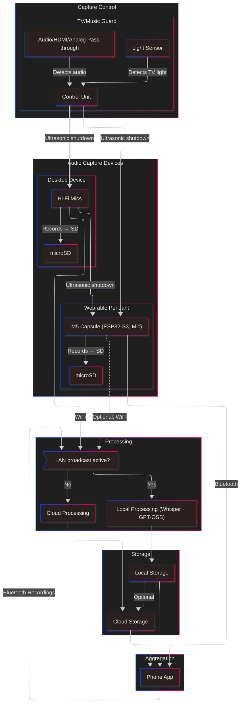

# Pendant

## TBD

Bluetooth proxy for call transcription

## Diagram

```mermaid
---
config:
  look: neo
  layout: elk
  theme: neo-dark
id: 824b7c2c-b7c8-4d31-b8a3-c5ca4e5234b2
---
flowchart TB
  subgraph PendantGroup["Wearable Pendant"]
    Pendant["M5 Capsule (ESP32-S3, Mic)"]
    PendantSD["microSD"]
  end
  subgraph DesktopGroup["Desktop Device"]
    Desktop["Hi-Fi Mics"]
    DesktopSD["microSD"]
  end
  subgraph Capture["Audio Capture Devices"]
    direction LR
      PendantGroup
      DesktopGroup
  end
  subgraph TVGuard["TV/Music Guard"]
    Passthrough["Audio/HDMI/Analog Pass-through"]
    LightSensor["Light Sensor"]
    ControlUnit["Control Unit"]
  end
  subgraph Control["Capture Control"]
    TVGuard
  end
  subgraph Aggregation["Aggregation"]
    Phone["Phone App"]
  end
  subgraph Processing["Processing"]
    Decision>"LAN broadcast active?"]
    LocalProc["Local Processing (Whisper + GPT-OSS)"]
    CloudProc["Cloud Processing"]
  end
  subgraph Storage["Storage"]
    LocalStorage["Local Storage"]
    CloudStorage["Cloud Storage"]
  end
  Desktop -- Ultrasonic shutdown ---> Pendant
  ControlUnit -- Ultrasonic shutdown ---> Pendant
  Passthrough -- Detects audio --> ControlUnit
  LightSensor -- Detects TV light --> ControlUnit
  Pendant -- Records → SD --> PendantSD
  Desktop -- Records → SD --> DesktopSD
  Pendant -- Bluetooth --> Phone
  Decision -- Yes --> LocalProc
  Decision -- No --> CloudProc
  LocalProc --> LocalStorage
  CloudProc --> CloudStorage
  LocalStorage -. Optional .-> CloudStorage
  LocalStorage --> Phone
  CloudStorage --> Phone
  Pendant -. Optional: WiFi .-> Decision
  Desktop -- WiFi --> Decision
  ControlUnit == Ultrasonic shutdown ==> Desktop
  Phone -- Bluetooth Recordings --> Decision
```
