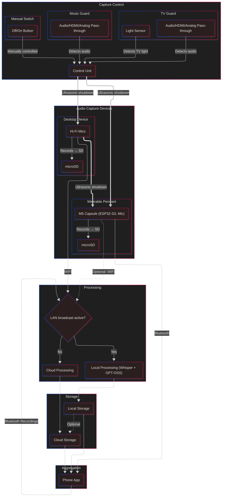

# Pendant

## Notes

- TBD in the diagram: Bluetooth proxy for call transcription.
- Manual switch should be one of those really funky buttons with a display on them so that they can reflect the current state as it changes.
  - The [NKK `ISC15ANP4`][nkk-button] might work.

## Diagram

[nkk-button]: https://www.nkkswitches.com/wp-content/themes/impress-blank/search/inc/part.php?part_no=ISC15ANP4
