# Ambio: Always-on Conversation Recorder Pendant

## 🩻 **Summary**

I can see four possible components. The first being a pendant itself, based around the M5 capsule, which has a microphone, microSD storage, and is based around the ESP32 S3. There should be enough compute on board. We can write recordings to the SD card when we're away from the phone and transfer recordings over Bluetooth when we're close to the phone.

The second component I can imagine is a desktop device with better microphones that could be used to record meetings or whatever around a table, something like that.

A third device is various flavors of ways to stop the pendant picking up the television, music, or anything like that. My theory on that is, first of all, we filter for voice frequencies on the ESP32, so we're only picking up when people are speaking. But secondly, I'm thinking a device that has an audio pass-through—so an analog audio pass-through, a digital audio pass-through, and potentially an HDMI pass-through.

Finally, a Bluetooth proxy. A headset would connect to it as if it were an audio I/O source. It would then connect to an audio I/O source, as if it were a headset. This would put it inline for all audio in and out, which we could then capture and send to the backend. We'd need to be thoughtful of latency here.

The other thing I'm thinking is a light detector, which could be attached to the LED of the television or to the screen itself. You can set it so that if there is light, it means the television is on, and if not, it's off. Also a manual switch, using one of [those funky NKK buttons with a display](https://www.nkkswitches.com/wp-content/themes/impress-blank/search/inc/part.php?part_no=ISC15ANP4) so that it could be updated as to whether you're turning the audio on or off.

When they see the television active, they send out an ultrasonic signal. Incidentally, so does the desktop device. When the pendant picks up the ultrasonics, it shuts down recording. So what we end up doing is only recording when the ultrasonics aren't present. We should probably code the ultrasonics. I'll need to look into how we can do that. But yeah, maybe we can code the ultrasonics to actually tell the pendant which device is shutting it down and log that.

Anyway. What I'm thinking is then we have some kind of container, release it as a Docker container, that runs OpenAI Whisper and GPT-OSS, which will process the recordings. The phone will turn them to it. It will do its magic. I could probably host it on the NAS, but it could go anywhere really.

And then the phone will write to the cloud storage, the account for the system. Then the phone will be able to read the account and display the conversations that have been had, action items, things like that. That's the plan.

I might come up with additionals, but I thnk that's where we can get started.

Additional: thermal camera with wide FOV. Detect warm bodies to inform recording decisions.

```mermaid
---
config:
  look: neo
  layout: dagre
  theme: neo-dark
id: 3cbbc683-011d-4bf0-ac31-0102570e1412
---
flowchart TB
 subgraph BluetoothGroup["Bluetooth proxy"]
        Bluetooth["Bluetooth proxy"]
        BluetoothSD["microSD"]
  end
 subgraph DesktopGroup["Desktop Device"]
        Desktop["Hi-Fi Mics"]
        DesktopSD["microSD"]
  end
 subgraph PendantGroup["Wearable Pendant"]
        Pendant["M5 Capsule (ESP32-S3, Mic)"]
        PendantSD["microSD"]
  end
 subgraph Capture["Audio Capture Devices"]
    direction LR
        PendantGroup
        DesktopGroup
        BluetoothGroup
  end
 subgraph TVGuard["TV Guard"]
        Passthrough["Audio/HDMI/Analog Pass-through"]
        LightSensor["Light Sensor"]
  end
 subgraph MusicGuard["Music Guard"]
        MPassthrough["Audio/HDMI/Analog Pass-through"]
  end
 subgraph ManualGuard["Manual Switch"]
        Switch["Off/On Button"]
  end
 subgraph Control["Capture Control"]
        TVGuard
        MusicGuard
        ManualGuard
        ControlUnit["Control Unit"]
  end
 subgraph Aggregation["Aggregation"]
        Phone["Phone App"]
  end
 subgraph Processing["Processing"]
        Decision{"LAN broadcast active?"}
        LocalProc["Local Processing (Whisper + GPT-OSS)"]
        CloudProc["Cloud Processing"]
  end
 subgraph Storage["Storage"]
        LocalStorage["Local Storage"]
        CloudStorage["Cloud Storage"]
  end
    Desktop == Ultrasonic shutdown ==> Pendant
    ControlUnit == Ultrasonic shutdown ==> Pendant & Desktop
    Passthrough -- Detects audio --> ControlUnit
    LightSensor -- Detects TV light --> ControlUnit
    MPassthrough -- Detects audio --> ControlUnit
    Switch -- Manually controlled --> ControlUnit
    Pendant -- Records → SD --> PendantSD
    Desktop -- Records → SD --> DesktopSD
    Pendant -- Bluetooth --> Phone
    Pendant -. Optional: WiFi .-> Decision
    Bluetooth -- WiFi --> Decision
    Bluetooth -- Records → SD --> BluetoothSD
    Desktop -- WiFi --> Decision
    Phone -- Bluetooth Recordings --> Decision
    Decision -- Yes --> LocalProc
    Decision -- No --> CloudProc
    CloudProc --> CloudStorage
    LocalProc --> LocalStorage
    LocalStorage --> Phone
    LocalStorage -. Optional .-> CloudStorage
    CloudStorage --> Phone
    Bluetooth == Ultrasonic shutdown ==> Pendant
```

## 📦 Links and **Related Material**

There's some [documentation on the M5 Capsule](https://docs.m5stack.com/en/core/M5Capsule) on [the M5`docs`site](https://docs.m5stack.com).

There's also [the Capsule's `shop` listing](https://shop.m5stack.com/products/m5stack-capsule-kit-w-m5stamps3).

---

## 🫧 **Further Detail**

+++ Project name candidates

- Memora
- Rem(t)ory?
- Keepsake
- Locket
- Vox
- Rememori
- Memoir(e)
- Talisman
- The Pendant Project ([https://i.dave.io/MTc2NjA3Mzc2NTYxOQ](https://i.dave.io/MTc2NjA3Mzc2NTYxOQ))
- Memorable
- Sentien
- Sentiv
- Kabin
- Karabiner
- Ambio

+++

### Project name

**Ambio.** Registered [https://ambio.systems](https://ambio.systems) with Cloudflare 2025-12-18

### Very early logo ideas

